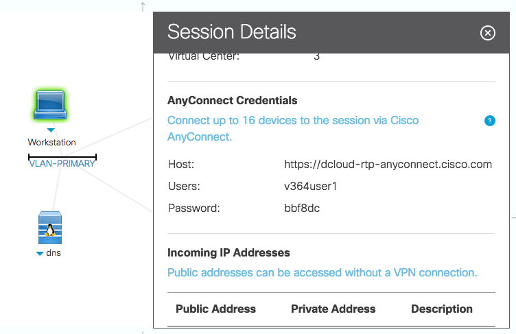

# Opendaylight-Setup
## Intro
This directory contains setup scripts for ODL, and is particularly designed to be work with [Cisco dCloud](https://dcloud.cisco.com).

This project is forked from [CiscoDevNet](https://github.com/CiscoDevNet/opendaylight-setup).  However, netconf related scripts are removed for demo purpose.

## Preparation
* Start with a Linux host or VM with git installed (at a minimum).  Vim is also recommended for editing ODL config files, but it's up to your needs. 

 > **Ubuntu 14.04** is recommended, as it has been well tested on.  You can also choose to use other version of Linux if you wish.
However, you may want to tweak a few scripts such as `bin/setup-env` to make them work on your version of Linux.  OpenDayLight **may not may** not work properly on other Linux distribution.

* Clone this repo to a working directory:

	`git clone https://github.com/kevinxw/opendaylight-setup.git ODL`
	
##Installation Instructions
###Setup Environment with Script Provided
1. Run `bin/setup-odl` to setup your environment, download and unpack ODL release distro
2. Go to [Setup ODL](#setup-odl) and following the steps.

###Manually Setup Environment
0. Install environment requirement: *OpenConnect*, *OpenJDK 8* etc.

1.  Download recommended ODL version:

    * to download the latest release version (recommended):
    `bin/download-distro release`

    * to download the lastest snapshot version:
    `bin/download-distro snapshot`
    
    >Optionally, you can download the appropriate OpenDaylight distribution file (.tar.gz) from [OpenDayLight Download Page](https://www.opendaylight.org/downloads) (or other location) to images directory:

  >Example: (Assumes you are downloading the "**Beryllium-SR3**" release.)

  >`wget -P images https://nexus.opendaylight.org/content/repositories/public/org/opendaylight/integration/distribution-karaf/0.4.3-Beryllium-SR3/distribution-karaf-0.4.3-Beryllium-SR3.tar.gz`

3.  Unpack ODL using

  `bin/unpack-odl`

  ***NOTICE*** You should only have one distribution image under *images* directory before doing this step.
  
4. Continue [setting up ODL](#setup-odl)

### <a name="setup-odl">Setup ODL</a>
4.  **Optionally** edit the *parameters* file to change the set of features installed at ODL startup.

5.  **Optionally** edit the *log4j.conf* file to change the set of additional logging activated at ODL startup.
 
6.  Set up ODL using (this loads key features and logging configs)

  `bin/config-odl`

  You want to do this step everytime you changed the *parameters* file or *log4j.conf* file.
   
7. Change *vpn\_credential* file to reflect your dCloud credential

   * There is a *vpn_credential.example* file in root directory. You should copy that file with command `cp vpn_credential.example vpn_credential` and then change the parameters in *vpn_credential* file.
	
	* *DCLOUD\_VPN\_SITE* is one of *rtp*, *lon*, *sng* or *chi*. For North America, by default the site is *rtp*.
	* username and password can be found in your dCloud session details
	* You can find your dCloud credential under the **Session Details** of the dCloud dashboard.  Click on the **Workstation** icon to reveal it.

	

	(note that your unix account will need sudo privileges)

  Then run `bin/start_vpn` to start the VPN session

13. Start ODL using

  `bin/start-odl`

14.  You can use `bin/check_vpn_status` to get the VPN tunnel interface information. Use the IP of the tunnel to configure your router.
  
  After connecting to VPN, you can reach the router by using the command

  ```
  source ./parameters
  telnet $BGP_PEER
  ```

  You can find a list of all other routers avaiable in the *nodes* file

## Vagrant
 
The repository also contains a subdirectory *vagrant* which contains a Vagrantfile and bootstrap.sh script.

If you have [Vagrant](https://www.vagrantup.com/downloads.html) and VirtualBox or VMWare Workstation/Fusion installed you can do a "vagrant up" from that directory and a VirtualBox VM will be created consisting of:

* Ubuntu 14.04
* git
* vim
* all required software mentioned above
* this repository

Note that the Vagrantfile is currently configured to allocate 2 vCPUs and 8GB of RAM to the VM.   If your machine only has 8GB of RAM then you may wish to allocate 4GB of RAM.  Likewise if you only have 2 CPU cores you may wish to allocate 1 vCPU.   Equally if you want to use a different hypervisor you will need to edit the Vagrantfile.

## Scripts Included

**config-odl** sets up logging/features for ODL

**unpack-odl** unpacks the .tar.gz file.  Creates a new subdirectory for the ODL distro.

**setup-odl** automatically install release ODL distro. It stops before *config-odl*

**start-vpn** connects to dCloud VPN.  Takes *vpn\_crendential* to read required credential.  

**stop-vpn** disconnects from dCloud VPN

**start-odl** cleans out data from previous runs and starts ODL

**stop-odl** stops ODL

**config-odl** sets up NETCONF nodes, BGP etc. - uses scripts from the python subdirectory (plus in the dCloud case REST calls to dCloud APIs)

**delete-odl** deletes the ODL distribution

**tail-log** shortcut to access karaf log

**check-vpn-status** check VPN status

**karaf-client** shortcut to access karaf console

## Additional Files

**parameters** parameters - encoded as environment vars:

* DISTRO (name of ODL distribution)
* BGP_PEER (IP address of default BGP peer)
* LOCAL_AS
* REMOTE_AS
* ODL_USER
* ODL_PASS
* DCLOUD (YES or NO)
* FEATURES (list of features to add to ODL's default set)

**log4j.conf** log4j configuration, used to override ODL's default log4j config

**nodes** list of router nodes exist in dCloud (each line consists of a node name which indicating site name and node IP address)
