# Setup Network Environment

This tutorial is to help you set up the network environment, so you can peer your OpenDayLight controller with virtual routers.

## Network Diagram & Components

Topology of network that we shall be putting together for this tutorial
is depicted below. It comprises of OpenDaylight Controller VM in local
computing environment connected to Cisco Virtual Internet Routing Lab
(VIRL) based network simulation running in Cisco dCloud environment,
over Anyconnect VPN

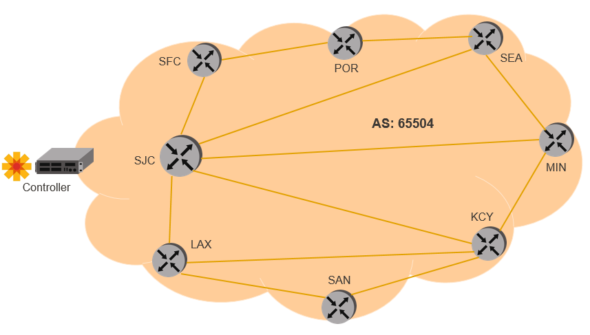

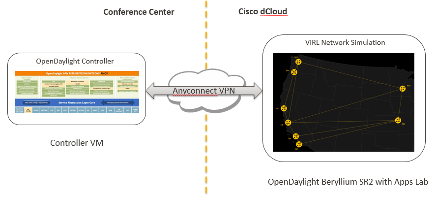

## Start Cisco dCloud environment

Follow below steps to launch the network simulation

### Create an account and login into Cisco dCloud

1.  Open <https://dcloud.cisco.com/> in your browser and click on
    **Login** button
    
	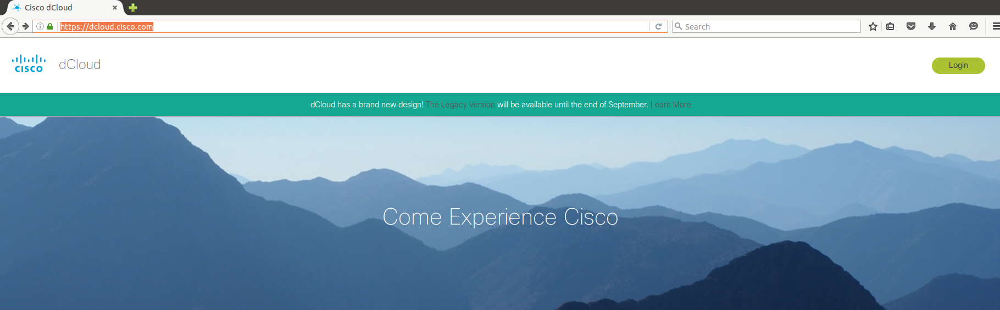
	
2.  If you already have a Cisco account, login using that and start [scheduling a ODL lab](#schedule)
	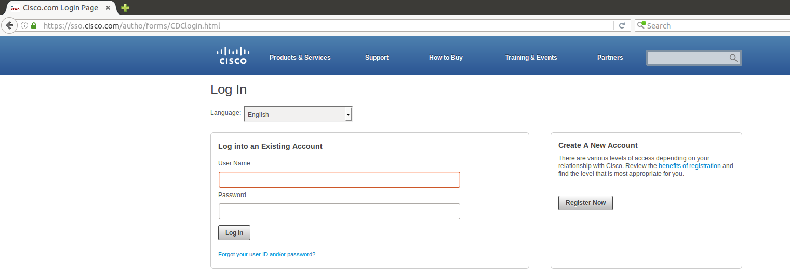
	
	> Optionally click on **Register Now** button to get a free account
    
	> Enter required details and create new account. Login to dCloud
    portal using the new account details

	> 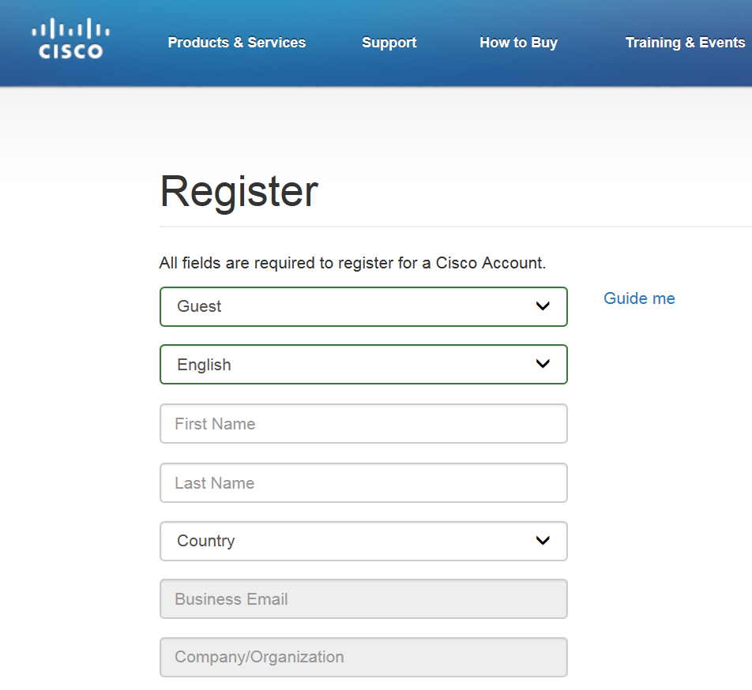

### <a name="schedule">Find and schedule the OpenDaylight lab</a>

1.  Navigate to **Dashboard** **My Sessions** and click on **find
    content**

	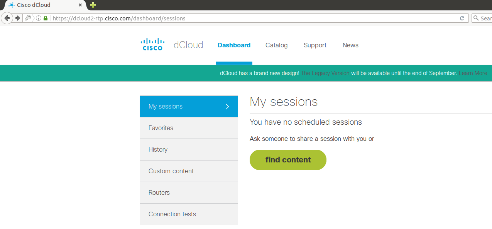

2.  Search Catalog for “OpenDaylight Beryllium SR2 with Apps with 8
    Nodes v1”

	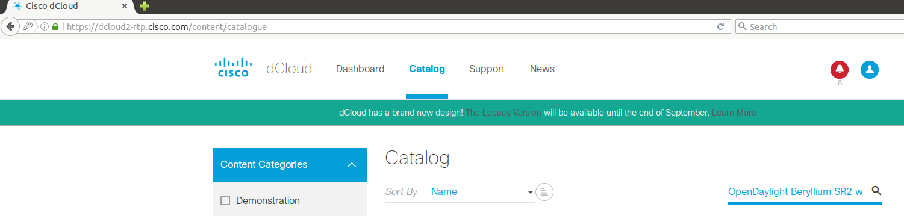

3.  Click on **Schedule** button of the lab displayed

	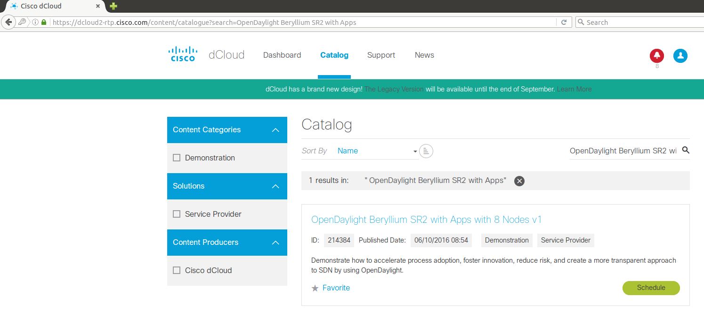
	
4.  Click on **Now** button. By default, the scheduled duration will be
    4 hours. Adjust the end time for the desired duration **(min. 5
    hours recommended)**. Go to bottom of page and click on **Next**

	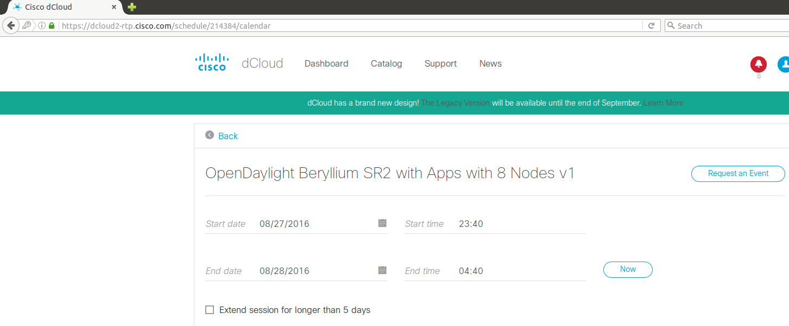

5.  Enter the drop-down values appropriately and click on **Schedule**

	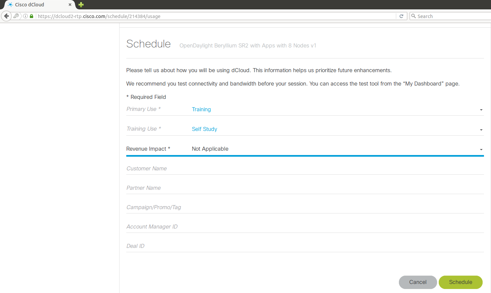

6.  The session should start within few minutes

	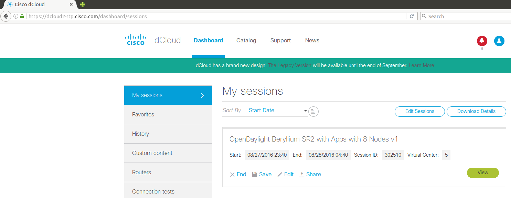

7.  Click on **View** button to see session details

	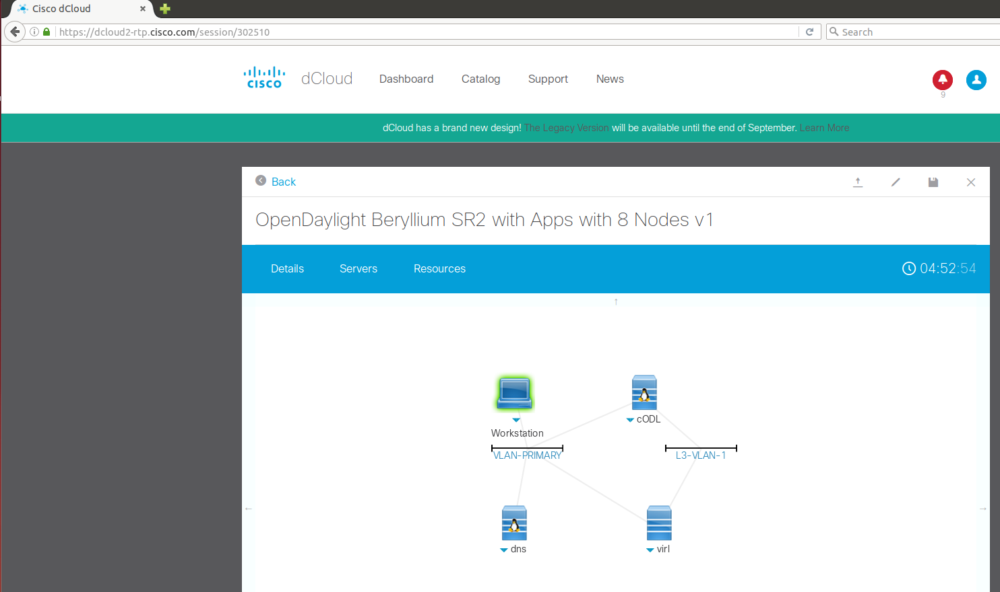

8.  Click on **Details** tab and note down the Anyconnect details, which will be used when connecting Controller VM to the dCloud environment

	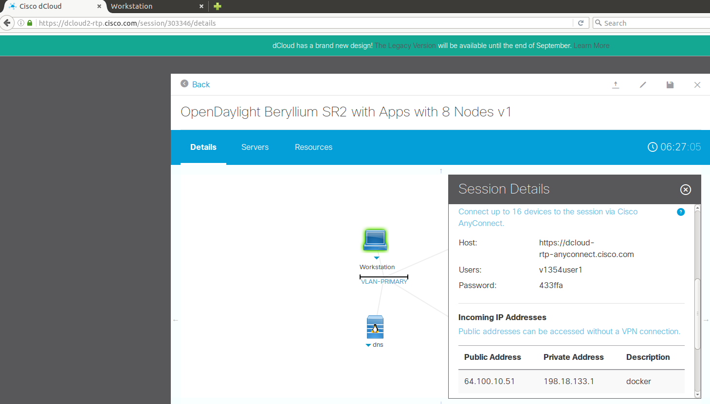

## Setup Controller VM

There are several options for creating the Controller VM. Please pick
the one which is best suited for your environment

  
| Option | Pre-requisites | Pros | Cons |
|--------------------------------------|--------------------------------------------------------------------|-------------------------------------------------------------------------------------------------------------------------------------|------------------------------------------------------------------------------------------------------------------------------------|
| [Preconfigured VM from USB stick](#preconfig_vm) | Hypervisor (e.g. Virtual Box) installed on your laptop | Controller and setup scripts are installed on this VM, so once you import and start the VM, you are good to go | <ul><li> USB stick availability </li><li> May take time to copy VM image from USB stick to laptop </li><li> Need free resources on laptop to start new VM </li></ul> |
| [Vagrant to launch preconfigured VM](#vagrant_vm) | Vagrant and Hypervisor (e.g. Virtual Box) installed on your laptop | If you have the pre-requisites and are familiar,with using Vagrant, this option provides an easy way to get the Controller VM,ready | <ul><li>vagrant up may take time to download/config the VM and Controller </li><li> Need free resources on laptop to start new VM </li></ul> |
| [Vanilla VM with manual configuration](#vanilla_vm) | Access to any recent version of Ubuntu or CentOS,VM | Don’t need to spin-up a new VM, so no additional,resources needed on laptop | <ul><li>May take time to download/config the VM and Controller </li><li> Environment may be different than reference VM causing some issues </li></ul> |

### <a name="preconfig_vm">Use preconfigured VM from USB stick</a>

1.  USB stick with preconfigured VM image are available. Please get it
    from one of the instructors or ask around

2.  Mount the USB stick and copy the preconfigured VM image (name TBD)

3.  Once the copy is done, unmount the stick and pass it around to
    others who need it

	> **Note** The USB sticks are limited in number – so once you are done
	> copying the image to your laptop, PLEASE pass them around. If no one
	> near you seems to be wanting it, please give it to one of the
	> instructors so that we can give it to people in different part of room
	> or those who may come late. Thanks for your co-operation!

1.  Extract the VM image to a local folder

2.  Import the image in Virtual Box or VMWare Player

3.  Boot-up the imported VM and login into it using below credentials:

    Username: `odlsummit`

    Password: `odlsummit`

4.  ODL setup scripts are already available under */home/odlsummit/ODL*
    directory

5.  OpenDaylight Controller (**Beryllium SR3** version) is installed
    under */home/odlsummit/ODL/distribution-karaf-0.4.3-Beryllium-SR3*
    directory

6.  Open file */home/odlsummit/ODL/README.md* and execute steps 8 through
    10

### <a name="vagrant_vm">Use Vagrant to launch pre-configured VM</a>

1.  This method requires Vagrant and Virtual Box to be pre-installed on
    your laptop. Install them if you don’t have them already

2.  Copy Vagrant folder from
    <https://github.com/kevinxw/opendaylight-setup/tree/master/vagrant>
    (final repo URL TBD) into a local folder on your laptop (needs
    update – should launch a Desktop version, default credentials should
    be `odlsummit`/`odlsummit`)

3.  Open a terminal and cd to the local folder directory

4.  Execute `vagrant up` command which will create a new VM under Virtual
    Box and run basic configuration commands on it

5.  Connect to the VM using `vagrant ssh` command (include procedure to
    access Desktop)

6.  ODL setup scripts will be available under */home/odlsummit/ODL*
    directory and OpenDaylight Controller (default: Beryllium
    SR3 version) will be installed under
    */home/odlsummit/ODL/distribution-karaf-0.4.3-Beryllium-SR3* directory

### <a name="vanilla_vm">Use any vanilla VM and configure manually</a>

1.  Ubuntu (recommend 14.04) or CentOS VM with any recent version can be used to host the
    ODL Controller.
    
    > Minimum specs are 2 CPU, 4 GB RAM and 20 GB of free
    disk space

2.  Login to your VM and install git package using appropriate commands
    for your platform

    Ubuntu:

    `sudo apt-get install git`

    CentOS:

    `sudo yum install git`

3.  Follow steps 1 through 10 listed in README.md file at
    <https://github.com/kevinxw/opendaylight-setup> (final repo URL TBD)

4.  ODL setup scripts will be available under */home/odlsummit/ODL*
    directory and OpenDaylight Controller (default: Beryllium
    SR3 version) will be installed under
    */home/odlsummit/ODL/distribution-karaf-0.4.3-Beryllium-SR3* directory

## Setup Verification

Finally, use the below steps to ensure that your setup is configured
properly. If any of the steps fail, please take help from any of the
instructors to debug the issue, before proceeding further

### Verification of dCloud setup

1.  Go to dCloud session details page and click on Workstation icon

	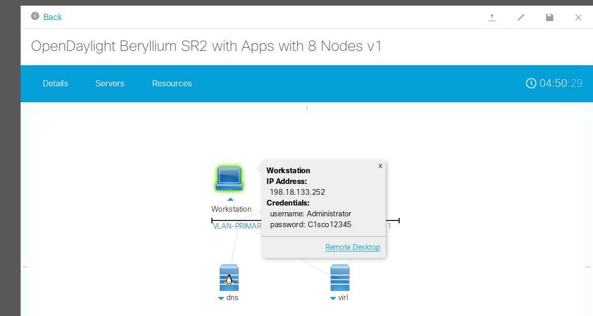

2.  Use the listed IP address and credentials with a local RDP client,
    or use the Remote Desktop web-client link provided to access the
    Workstation desktop. Chrome browser should open automatically with 3
    tabs, one of them being the status page with Launch Progress

	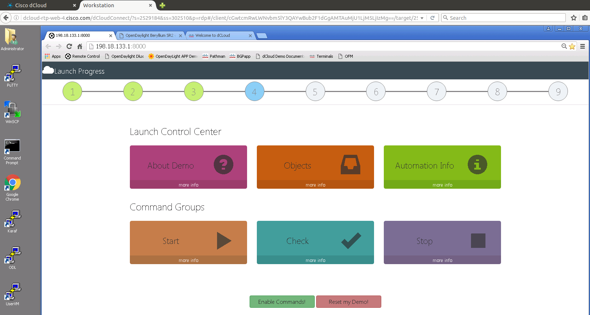

3.  Lab is fully initialized when steps 1 through 9 show up in
    green color. It may take up to 30 minutes for this to happen

	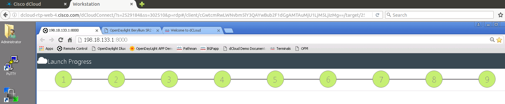

### Verification of Controller VM

1.  In Controller VM terminal, execute command ps -ef |grep karaf. It
    should display one entry showing the Controller process

	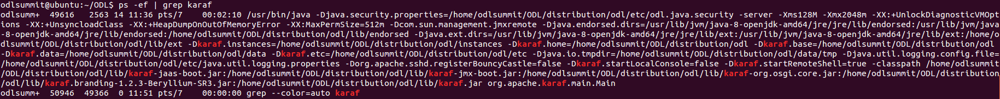

### Verification of connectivity between dCloud network simulation and Controller VM

1.  In a Controller VM terminal, cd to ODL directory and execute
    command `bin/check_vpn_status`. It should show that Anyconnect VPN
    is connected

2.  Ping IP address of SJC XRv router using command `source ./parameters
    && ping $BGP_PEER` and it should return success

	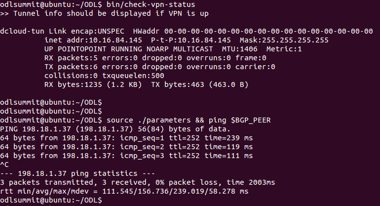
