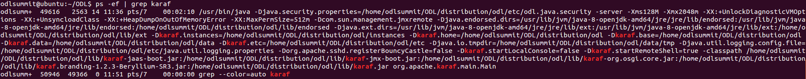

# BGP / PCEP Tutorial - ODL Summit 2016

## Prerequisite

### Prepare Your Environment

Before starting to experiment with anything, please prepare your environment following [this guide](./prepare-vm.md).

After this step, you should have a VM loaded with ODL distribution and necessary software we may use.

### Prepare Postman

Postman is a handy tool to send and receive HTTP request / response.  We are mainly using it to access RESTCONF resources in the controller.  Please follow the [guide](./config-postman.md) to set it up.

### Setup Cisco dCloud Lab

Following [this guide](./setup-dcloud.md) to set up your dCloud lab.  You will be able to access a number of XRv routers which are BGP and PCEP capable.  With them you are able to preceed with this tutorial.

## OpenDayLight

### Setup ODL

Assuming you have already got a VM with ODL distribution unpacked following the guides provided above, you need to configure the ODL before starting it.  Please use the following step to configure ODL:

1.  Open a terminal and switch to directory where you checked out this repository.  If you are using the preconfigured VM image we provided, or a VM spinned up with the Vagrant file in this repository, the directory should be at `~/ODL`.

4.  **Optionally** edit the `parameters` file to change the set of features installed at ODL startup.

5.  **Optionally** edit the `log4j.conf` file to change the set of additional logging activated at ODL startup.
 
6.  Set up ODL using (this loads key features and logging configs we just modified in the above two steps)

  `bin/config-odl`

  > **NOTE** `bin/config-odl` script should only be executed once after ODL distribution is unpacked.  You will need to manually edit the configuration files in ODL distribution directory if you want to update any ODL configuration after you run the `bin/config-odl` command.
 
### Start the OpenDayLight 

1. Start ODL using

  `bin/start-odl`
  
	> When you want to stop the ODL later, you can use the provided script `bin/stop-odl`.

2. After the ODL is started, you should be able to see the Karaf process running:

	

3. Now you need to make sure the VPN to dCloud lab is already connected.  If it's not, you need to connect it following the [steps here](./setup-dcloud.md#connect-to-dcloud-lab).
	
## BGP

[BGP](./config-bgp.md)

### BMP

[BMP](./config-bmp.md)

## PCEP

[PCEP](./config-pcep.md)