# Using ExaBGP

## Introduction

[ExaBGP](https://github.com/Exa-Networks/exabgp) – referred as “BGP swiss army knife of networking”, is a handy
tool for testing and debugging BGP features. We will use it to simulate
a BGP speaker and peer it with ODL.

ExaBGP is pre-installed on the tutorial VM image. If your are using your own VM, it
can be easily installed (e.g. `sudo apt-get install exabgp` command for
Ubuntu).

Execute `exabgp --help` command from a terminal windows to see the
various options that ExaBGP accepts. Typically a configuration file in
Windows INI format is provided to it during invocation.

ExaBGP uses default BGP port number **179**. Since ODL BGP speaker uses port
1790, ExaBGP command needs to be prepended with `env
exabgp.tcp.port=1790` during invocation to instruct it to use port **1790**
instead.

We provide a collection of [exabgp configuration examples](./exabgp-config) so that you can start to use it immedately.

Example ExaBGP usage (running under repository home directory):

```
env exabgp.tcp.port=1790 exabgp docs/tutorial/exabgp-config/boron/flowspec-vpn-ipv6.cfg
```

## Establish connection between ODL and one ExaBGP instance
In this exercise, we will establish BGP connection between ODL and
ExaBGP instance.

On ODL side, BGP RIB and Peer needs to be configured for this. This is
done by editing ODL BGP configuration file
`etc/opendaylight/karaf/41-bgp-example.xml` under the controller home
directory.

Open this file for editing and navigate to module with name
**example-bgp-rib**. Edit the value of &lt;bgp-rib-id&gt; attribute to
value **127.0.0.1**

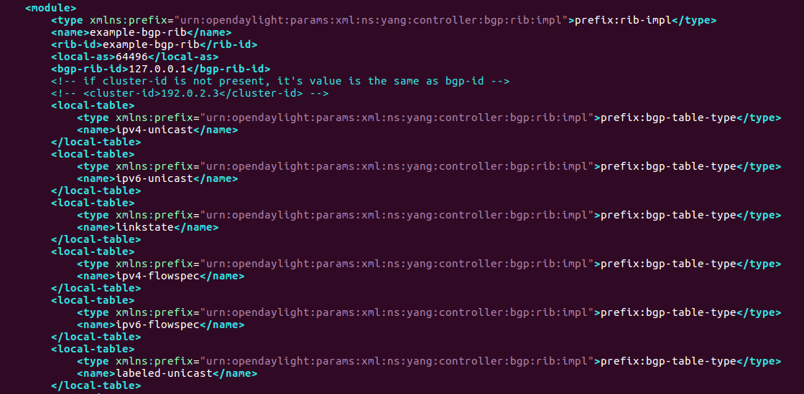

Now navigate to module with name **example-bgp-peer**. This module is
commented by default. Uncomment it and make the following changes:

1.  Change the value of **&lt;host&gt;** attribute to value **127.0.0.10**

2.  Add a new attribute **&lt;initiate-connection&gt;** with value false.
    This will prevent ODL trying to establish connection with ExaBGP (we
    want ExaBGP to initiate the connection towards ODL)

	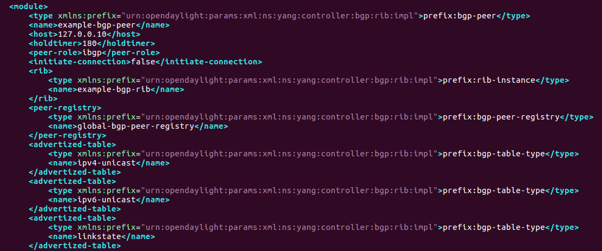

Restart ODL for the new configuration to take effect by running commands
bin/stop-odl followed by bin/start-odl from the ODL project directory.
After restart, ODL will read the new config and be ready for incoming
BGP connection from ExaBGP.

For ExaBGP instance configuration, create a file named exabgp-conf1.ini
and copy the below contents in it. This configuration creates a ExaBGP
instance with ODL configured as its peer and when the connection is
established, advertises route for prefix 10.0.1.0/24 with next-hop
10.10.1.1.

```
group exabgp1 {
	router-id 127.0.0.10;

	neighbor 127.0.0.1 {
		local-address 127.0.0.10;
		local-as 64496;
		peer-as 64496;
	
		family {
			ipv4 unicast;
		}
	
		static {
			route 10.0.1.0/24 next-hop 10.10.1.1;
		}
	}
}
```
> An [example configuration](./exabgp-config/beryllium/exabgp-conf1.cfg) is provided, so you can use the provided configuration directly.

We want to capture and analyze BGP messages exchanged between ODL and
ExaBGP during connection establishment. Open another terminal window and
launch Wireshark using “wireshark” command. Then go to Capture -&gt;
Options menu, select interface entry named “any”, specify capture filter
as “tcp port 1790” and start the capture.

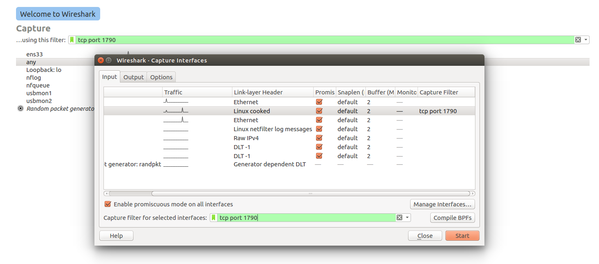

Now open another terminal window and launch ExaBGP instance by running
`env exabgp.tcp.port=1790 exabgp docs/tutorial/exabgp-config/beryllium/exabgp-conf1.cfg` command. If
everything goes fine, BGP connection should get established and
appropriate message should be displayed in ExaBGP log.

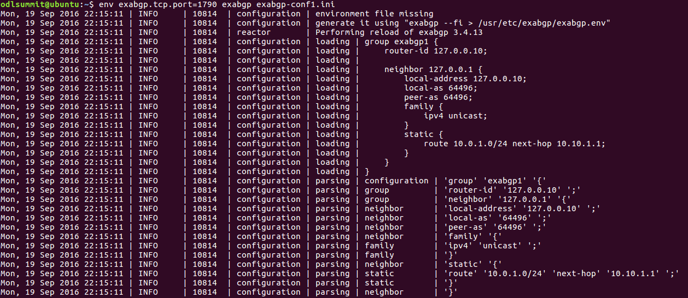

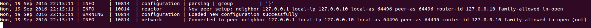

Stop the Wireshark packet capture. Analyze the BGP messages (e.g. OPEN,
UPDATE, KEEPALIVE) exchanged between ODL and ExaBGP and verify that
their values are as expected. ExaBGP should have advertise prefix
10.0.1.0/24 in its UPDATE message.

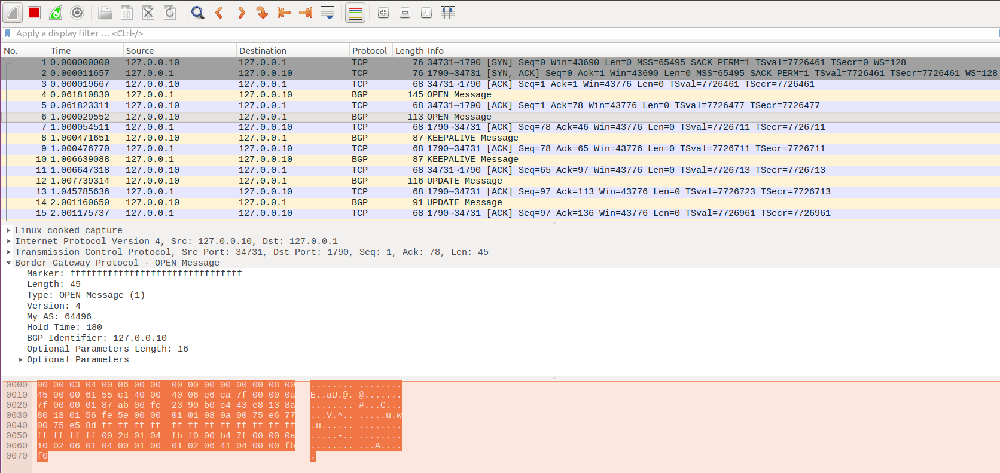

Open Postman REST Client and go to **BGP/PCEP – Beryllium -&gt; RIB**
folder. Execute GET request “BGP RIB” which will return operational
state of ODL BGP RIB. Verify that prefix 10.0.1.0/24 is present in
ExaBGP{ peer’s Adj-RIB-In and Effectice-RIB-IN, and in the Loc-RIB.

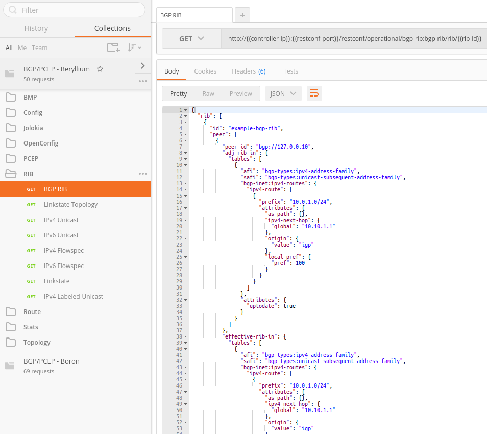

Go to Topology folder and execute GET request “IPv4 Topology”. Verify
that IPv4 reachability information in terms of next-hop prefix as node
and list of prefixes (only one in this case) reachable through it as
node-attributes is displayed.

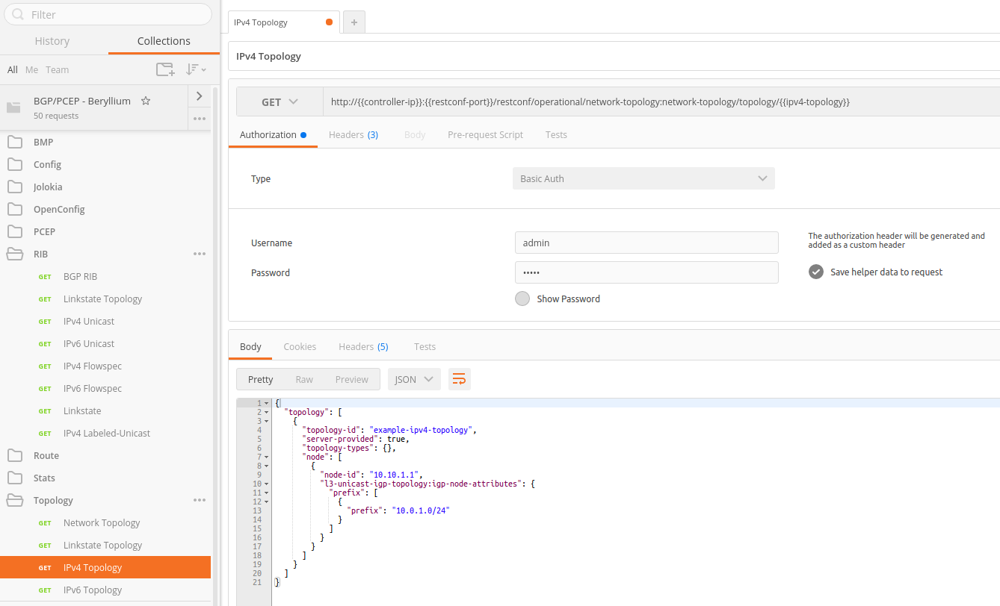

## Establish connection between ODL and two ExaBGP instances

This exercise is similar to previous one with the difference that here
we will launch two ExaBGP instances to establish connection with ODL.

Edit ODL configuration file `etc/opendaylight/karaf/41-bgp-example.xml`
and add a new bgp-peer module, similar to the previous one but with
following differences:

1.  &lt;name&gt; attribute value as “example-bgp-peer-2”

2.  &lt;host&gt; attribute value as 127.0.0.20

> 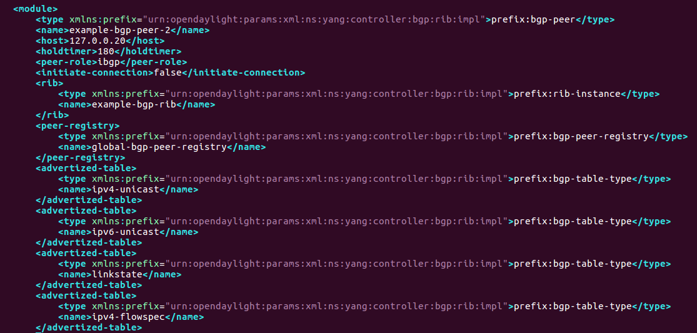

Restart ODL so that the new configuration file takes effect.

Create a new ExaBGP configuration file named [exabgp-conf2.cfg](./exabgp-config/beryllium/exabgp-conf2.cfg) and copy
the below contents into it:

```
group exabgp2 {
	router-id 127.0.0.20;
	
	neighbor 127.0.0.1 {
		local-address 127.0.0.20;
		local-as 64496;
		peer-as 64496;
		
		family {
			ipv4 unicast;
		}
		
		static {
			route 10.0.2.0/24 next-hop 10.10.1.2;
		}
	}
}
```

> An [example configuration](./exabgp-config/beryllium/exabgp-conf2.cfg) is provided, so you can use the provided configuration directly.

Launch the a second ExaBGP instances in a separate terminal window:

`env exabgp.tcp.port=1790 exabgp docs/tutorial/exabgp-config/beryllium/exabgp-conf2.cfg`

Then check the logs to confirm that BGP connection with ODL is established in both
cases.

Fetch operational state of BGP RIB through RESTCONF request and verify
that prefixes 10.0.1.0/24 and 10.0.2.0/24 advertised by the two ExaBGP
instances respectively are present.

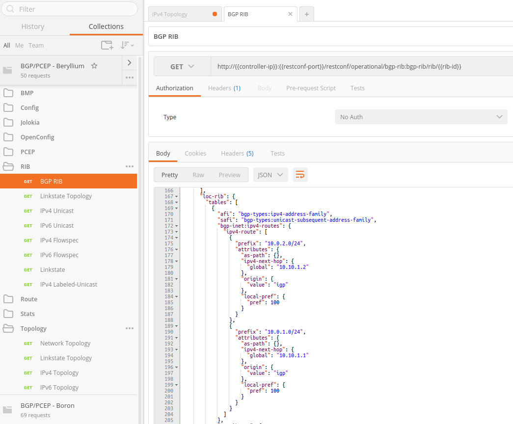

However note that Adj-RIB-Out of both ExaBGP peers remain empty. Why
does ODL not advertise route learnt from one peer to the other peer?

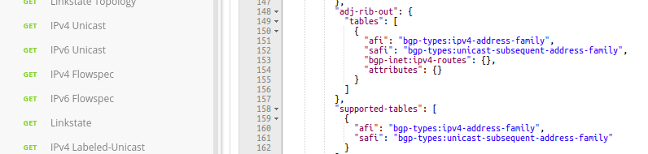

## Configure ODL as a Route Reflector

In previous exercise, ODL did not advertise prefix learnt from one
ExaBGP peer to other ExaBGP peer because default peer-type in ODL
bgp-peer config is “ibgp” and IBGP forwarding rules do not allow routes
learnt from one IBGP peer to be re-advertised to another IBGP peer.

The ExaBGP peers can be configured as Route Reflector client by
configuring &lt;peer-role&gt; attribute in bgp-peer module of
`etc/opendaylight/karaf/41-bgp-example.xml` to value “rr-client”. Make
this change and re-execute steps in previous exercise.

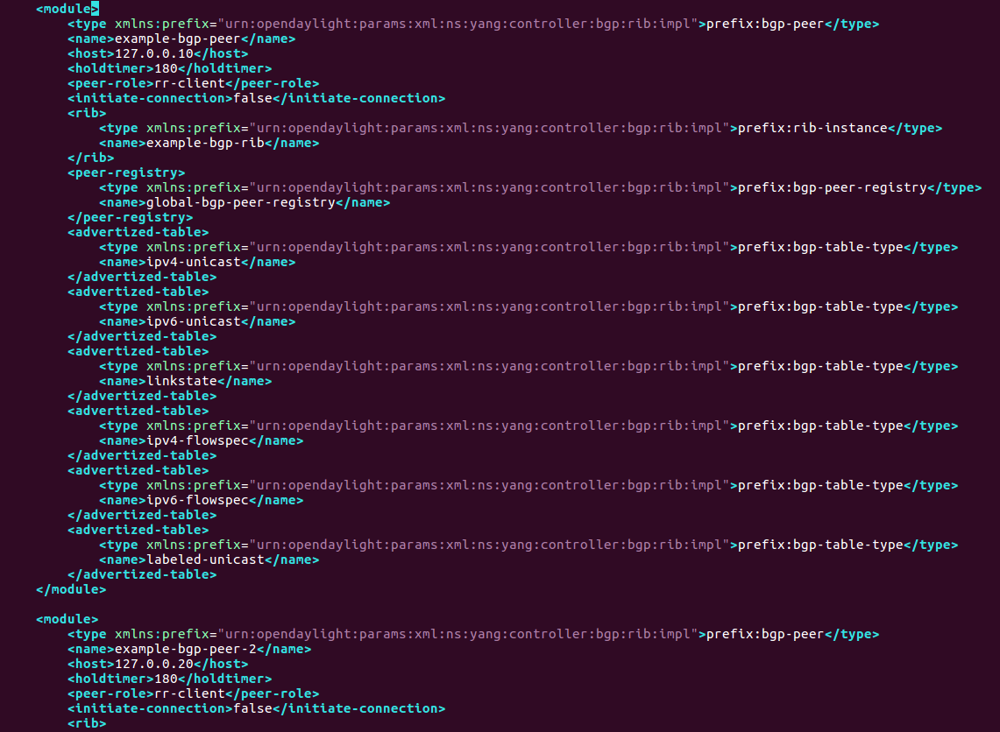

Check the Adj-RIB-Out of both peers to verify that prefixes are now
being re-advertised to each other. Also map the re-advertisement of
prefixes to UPDATE messages exchanged between the BGP speakers in the
Wireshark packet capture.

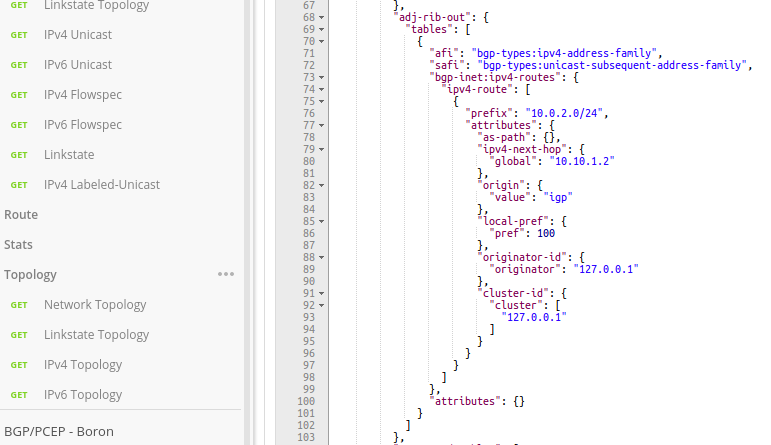

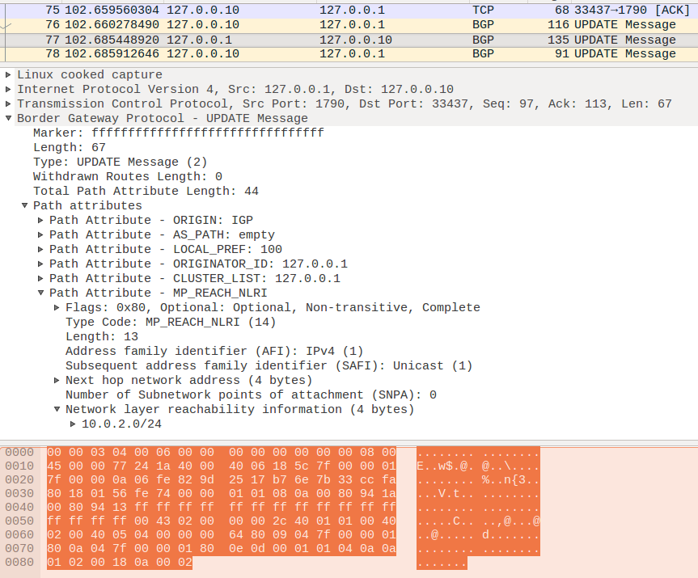
