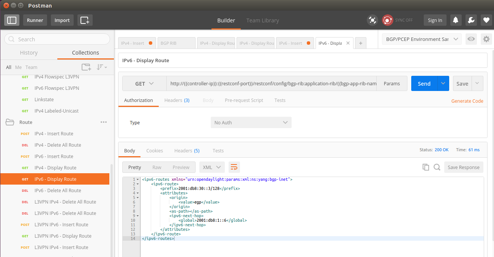
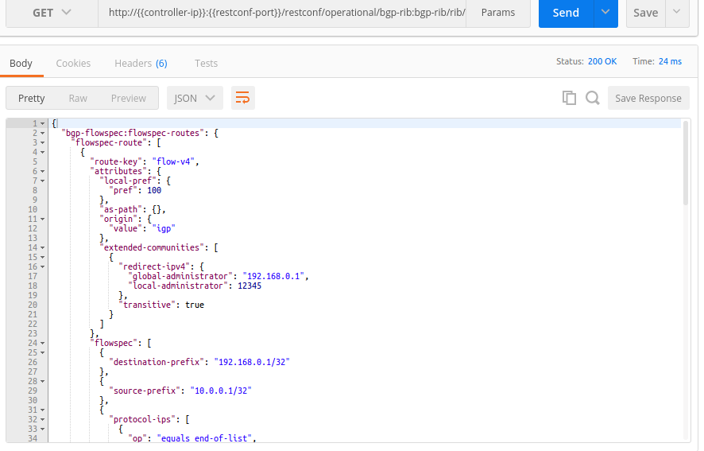

# Configure BGP with XRv in Cisco dCloud Lab

**NOTE** We are assuming you are starting this part of tutorial with a fresh installed controller.  You have changed the 41-bgp-example.xml configuration a bit following the other part of tutorial (e.g. following the exaBGP tutorial), you may see a different initial configuration.  However, that should not affect your exercise.

## Change BGP Configurations

To add/edit BGP peers, you will need to change a few BGP configuration files.  These files are managed by the config subsystem of ODL.  They are loaded when the ODL is started.

A much detailed guide exists in [OpenDayLight BGPCEP project wiki](https://wiki.opendaylight.org/view/BGP_LS_PCEP:Main).  Read the **User Guide** of the corresponding ODL version which you are using.

In this tutorial, we are playing with the Beryllium version of ODL.  So you should be looking at the [Beryllium User Guide](https://wiki.opendaylight.org/view/BGP_LS_PCEP:Beryllium_User_Guide).
 
### Change 41-bgp-config-example.xml

The BGP peer configuration is located in file `etc/opendaylight/karaf/41-bgp-example.xml` under ODL directory.

> In this turotial, we are installing ODL under directory `distribution/odl`. So the complete file path should be `distribution/odl/etc/opendaylight/karaf/41-bgp-example.xml`

To edit the configuration file, use the following command in your bash shell:

`gedit distribution/odl/etc/opendaylight/karaf/41-bgp-example.xml >/dev/null 2>&1 &`

#### Update BGP RIB

Find the following section in the 41-bgp-example.xml:

```
                <module>
                    <type xmlns:prefix="urn:opendaylight:params:xml:ns:yang:controller:bgp:rib:impl">prefix:rib-impl</type>
                    ...
                </module>
```

Change the related fields to fit your need.  In this tutorial, we need to change **local-as** field to **65504**.  You should change **bgp-rib-id** to the real IP of your local controller (which you can find with script `bin/check-vpn-status`).

A sample configuration is displayed as follows:

```
                <module>
                    <type xmlns:prefix="urn:opendaylight:params:xml:ns:yang:controller:bgp:rib:impl">prefix:rib-impl</type>
                    <name>example-bgp-rib</name>
                    <rib-id>example-bgp-rib</rib-id>
                    <local-as>65504</local-as>
                    <bgp-rib-id>10.16.90.49</bgp-rib-id>
                    <!-- if cluster-id is not present, it's value is the same as bgp-id -->
                    <!-- <cluster-id>192.0.2.3</cluster-id> -->
                    ...
                </module>
```

> Assuming **10.16.90.49** the real IP of your controller here.

#### Update BGP Peer

Find the following section in 41-bgp-example.xml:

```
                <module>
                    <type xmlns:prefix="urn:opendaylight:params:xml:ns:yang:controller:bgp:rib:impl">prefix:bgp-peer</type>
                    ...
                </module>
```

By default, the whole section is commentted out, so ODL is not expecting any BGP peer connecting to it.  We need to uncomment the whole section first, then change the BGP peer **host** IP in the section.  As we are peering with SJC router in dCloud, we are going to use its IP (198.18.1.37) here.
An example is shown as follows:

```
                <module>
                    <type xmlns:prefix="urn:opendaylight:params:xml:ns:yang:controller:bgp:rib:impl">prefix:bgp-peer</type>
                    <name>example-bgp-peer</name>
                    <host>198.18.1.37</host>
                    <holdtimer>180</holdtimer>
                    <peer-role>ibgp</peer-role>
                    <rib>
                        <type xmlns:prefix="urn:opendaylight:params:xml:ns:yang:controller:bgp:rib:impl">prefix:rib-instance</type>
                        <name>example-bgp-rib</name>
                    </rib>
                    ...
                </module>
```

### Restart OpenDayLight

To let ODL reload the config xml files, you will have to restart OpenDayLight.  You can restart ODL by running the two scripts provided by the project:

```
./bin/stop-odl
./bin/start-odl
```

You can monitor the karaf log either by running command `log:tail` in karaf console, or run the script provided `bin/tail-log`.

## Peer with XRv in dCloud Lab

Now, after you finishing configuring the BGP peer, you need to configure the XRv in Cisco dCloud lab so that they can connect to each other.

First, you need to telnet to the XRv in dCloud:


You can find the existing BGP configuration with command `show running-config router bgp`


```
 neighbor 198.18.1.80
  remote-as 65504
  update-source MgmtEth0/0/CPU0/0
  address-family ipv4 unicast
   route-reflector-client
  !
  address-family link-state link-state
   route-reflector-client
  !       
 !
```

**198.18.1.80** is the IP of the OpenDayLight controller hosted in Cisco dCloud.  As we are using our own controller for the tutorial, we want to replace the IP with our own controller's IP.

```
configure terminal
router bgp 65504
 no neighbor 198.18.1.80
 
 neighbor 10.16.90.49
  remote-as 65504
  update-source MgmtEth0/0/CPU0/0
  address-family ipv4 unicast
   route-reflector-client
  !
  address-family link-state link-state
   route-reflector-client
  !       
 !
commit
```

> Replace the **10.16.90.49** with your local controller's IP (the VPN tunnel's IP)

> Again, you can get your controller's real IP with script `./bin/check-vpn-status`

## Verify BGP RIB Information

After peering with the routers in dCloud, you should be able to see BGP peer information in controller.  There are two ways you can check if the peering is successful.

1. You can check the karaf log of your controller. Simply use the script provided `bin/tail-log`:

	```
2016-09-10 00:16:38,109 | INFO  | oupCloseable-2-1 | StrictBGPPeerRegistry            | 236 - org.opendaylight.bgpcep.bgp-rib-impl - 0.5.3.Beryllium-SR3 | BGP Open message session parameters differ, session still accepted.
2016-09-10 00:16:38,117 | INFO  | oupCloseable-2-1 | BGPSessionImpl                   | 236 - org.opendaylight.bgpcep.bgp-rib-impl - 0.5.3.Beryllium-SR3 | BGP HoldTimer new value: 180
2016-09-10 00:16:38,152 | INFO  | oupCloseable-2-1 | BGPPeer                          | 236 - org.opendaylight.bgpcep.bgp-rib-impl - 0.5.3.Beryllium-SR3 | Session with peer 198.18.1.37 went up with tables: [BgpTableTypeImpl [getAfi()=class org.opendaylight.yang.gen.v1.urn.opendaylight.params.xml.ns.yang.bgp.types.rev130919.Ipv4AddressFamily, getSafi()=class org.opendaylight.yang.gen.v1.urn.opendaylight.params.xml.ns.yang.bgp.types.rev130919.UnicastSubsequentAddressFamily], BgpTableTypeImpl [getAfi()=class org.opendaylight.yang.gen.v1.urn.opendaylight.params.xml.ns.yang.bgp.linkstate.rev150210.LinkstateAddressFamily, getSafi()=class org.opendaylight.yang.gen.v1.urn.opendaylight.params.xml.ns.yang.bgp.linkstate.rev150210.LinkstateSubsequentAddressFamily]]
2016-09-10 00:16:38,285 | INFO  | oupCloseable-2-1 | AbstractBGPSessionNegotiator     | 236 - org.opendaylight.bgpcep.bgp-rib-impl - 0.5.3.Beryllium-SR3 | BGP Session with peer [id: 0xfdcbed33, L:/10.16.22.180:37480 - R:/198.18.1.37:179] established successfully.
2016-09-10 00:16:45,640 | INFO  | oupCloseable-2-1 | BGPSynchronization               | 236 - org.opendaylight.bgpcep.bgp-rib-impl - 0.5.3.Beryllium-SR3 | BGP Synchronization finished for table TablesKey [_afi=class org.opendaylight.yang.gen.v1.urn.opendaylight.params.xml.ns.yang.bgp.linkstate.rev150210.LinkstateAddressFamily, _safi=class org.opendaylight.yang.gen.v1.urn.opendaylight.params.xml.ns.yang.bgp.linkstate.rev150210.LinkstateSubsequentAddressFamily] 
2016-09-10 00:16:46,041 | INFO  | oupCloseable-2-1 | BGPSynchronization               | 236 - org.opendaylight.bgpcep.bgp-rib-impl - 0.5.3.Beryllium-SR3 | BGP Synchronization finished for table TablesKey [_afi=class org.opendaylight.yang.gen.v1.urn.opendaylight.params.xml.ns.yang.bgp.types.rev130919.Ipv4AddressFamily, _safi=class org.opendaylight.yang.gen.v1.urn.opendaylight.params.xml.ns.yang.bgp.types.rev130919.UnicastSubsequentAddressFamily] 
	```

2. Check through RESTCONF.  You can check if BGP RIB is showing the routes broadcasted by the remote router (the response could be big, so actual text response is not pasted here):

	

## Inject Route

With OpenDayLight, you can easily inject routes to remote BGP routers via RESTCONF.

### Configure BGP Application Peer

To inject routes, an BGP application peer must be configured first.

Open `41-bgp-example.xml` file in your controller VM.  The application peer configuration doesn't exist in the `41-bgp-example.xml` file by default.  So you should add it after the BGP peer section.

> **NOTE** Remember to change the **bgp-peer-id** (**10.16.90.49** in this example) to your local controller's real IP.

```
                <module xmlns="urn:opendaylight:params:xml:ns:yang:controller:config">
                    <type xmlns:x="urn:opendaylight:params:xml:ns:yang:controller:bgp:rib:impl">x:bgp-application-peer</type>
                    <name>example-bgp-peer-app</name>
                    <bgp-peer-id xmlns="urn:opendaylight:params:xml:ns:yang:controller:bgp:rib:impl">10.16.90.49</bgp-peer-id> 
                    <target-rib xmlns="urn:opendaylight:params:xml:ns:yang:controller:bgp:rib:impl">
                        <type xmlns:x="urn:opendaylight:params:xml:ns:yang:controller:bgp:rib:impl">x:rib-instance</type>
                        <name>example-bgp-rib</name>
                    </target-rib>
                    <application-rib-id xmlns="urn:opendaylight:params:xml:ns:yang:controller:bgp:rib:impl">example-app-rib</application-rib-id>
                    <data-broker xmlns="urn:opendaylight:params:xml:ns:yang:controller:bgp:rib:impl">
                        <type xmlns:x="urn:opendaylight:params:xml:ns:yang:controller:md:sal:dom">x:dom-async-data-broker</type>
                        <name>pingpong-broker</name>
                    </data-broker>
                </module>
```

After BGP application peer configuration is added to the `41-bgp-example.xml` file, you will need to restart the controller to reload it.

### Inject IPv4 Unicast Routes

We can try injecting some IPv4 unicast routes to our BGP peers.  You can find the RESTCONF request available in the Postman collection provided.

Before injecting the routes, you can check if there is any routes exist in the XRv from the controller.  Type command `show bgp neighbor 10.16.90.49 route` in XRv console.  You should see no output returned.

> Replace **10.16.90.49** with your controller's IP.

Now let's inject some routes and check the XRv route again.


The XRv should display the inject routes:


You should also be able to see injected routes in ODL's operational data via RESTCONF:


### Inject IPv6 Unicast Routes

IPv6 unicast route injection is also supported since Beryllium.  It is exactly like injecting IPv4 routes.  The only difference is to use IPv6 address in this case.

To inject IPv6 unicast address to XRv, you will need to configure XRv to accept IPv6 unicast address family first.

Enable it with the following command:

```
router bgp 65504
  address-family ipv6 unicast
  !
  neighbor 10.16.90.49
    update-source MgmtEth0/0/CPU0/0
    address-family ipv6 unicast
 ```
 
> Replace **10.16.90.49** with your controller's IP.

As the **update-source** currently configured for BGP neighbor **10.16.90.49** is MgmtEth0/0/CPU0/0, we need to configure it to have a vaid IPv6 address.

```
interface MgmtEth0/0/CPU0/0
	ipv6 address 2001::1:2:3:4/32
```

> You should use a real IPv6 address instead of **2001::1:2:3:4/32** in real network environment.


The XRv should display the inject routes with command
`show bgp ipv6 unicast`:




### Inject IPv4 Flowspec Routes

IPv4/IPv6 Flowspec route injection is also supported since Beryllium.

To inject IPv4/IPv6 Flowspec address to XRv, you will need to configure XRv to accept IPv4/IPv6 Flowspec address family first.

Enable it with the following command:

```
router bgp 65504
  address-family ipv4 flowspec
  address-family ipv4 flowspec
  !
  neighbor 10.16.90.49
    update-source MgmtEth0/0/CPU0/0
    address-family ipv4 flowspec
    address-family ipv6 flowsepc
 ```
 
> Replace **10.16.90.49** with your controller's IP.

> Again, if you are using IPv6 flowspec, as the **update-source** currently configured for BGP neighbor **10.16.90.49** is MgmtEth0/0/CPU0/0, we need to configure it to have a vaid IPv6 address.

```
interface MgmtEth0/0/CPU0/0
	ipv6 address 2001::1:2:3:4/32
```

> You should use a real IPv6 address instead of **2001::1:2:3:4/32** in real network environment.

You can use the HTTP request in provided Postman collection.

The XRv should display the inject routes with command
`show bgp ipv4 flowspec`:




### Delete Injected Route

It is also possible to delete injected route via RESTCONF.  Please check the provided Postman collection.
