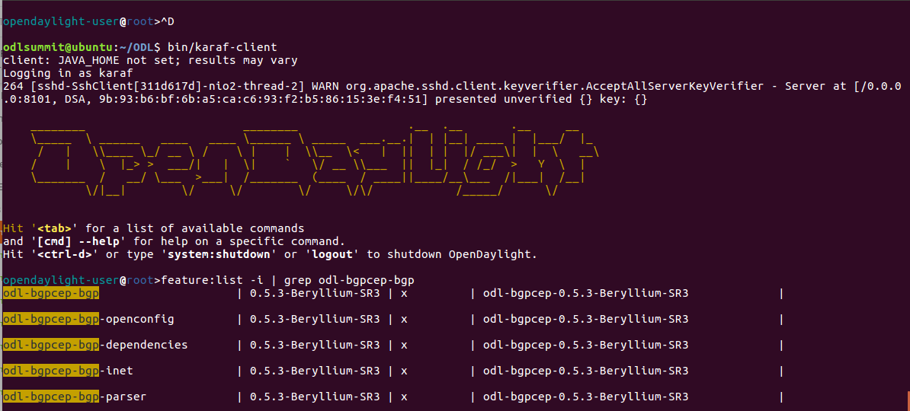
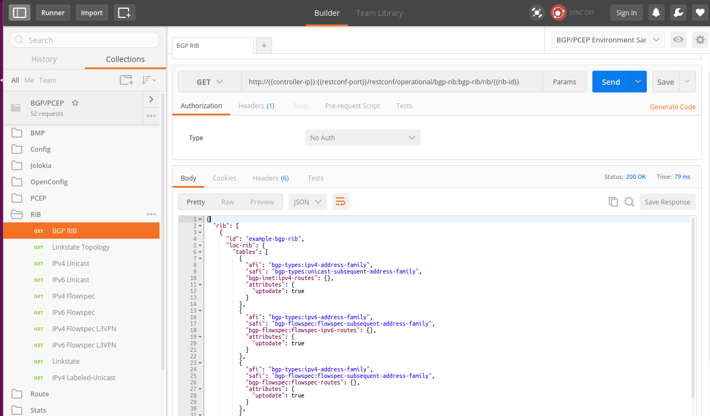
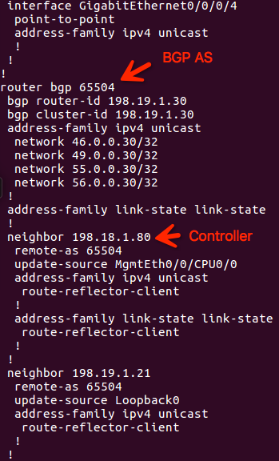

# Configure BGP on ODL
## Install BGP Feature on ODL

To install BGP feature, you need to enter karaf client first, then run the following command:

`feature:install odl-bgpcep-bgp`

If you are using the default *parameters* files provided by this project, the *odl-bgpcep-bgp* feature will be installed by default.

## Verify BGP Feature
After installing BGP feature, you should be able to see the bgp feature listed in the "installed feature" list.  You can simply verify it with command:

`feature:list -i | grep odl-bgpcep-bgp`

You should be able to see all the BGP related modules get installed.



Besides, you can also verify if BGP feature is functioning properly by accessing the BGP RESTCONF interface.  Simply checking if BGP RIB is returning the correct topology will be enough.

 

## Change BGP Configurations
To add/edit BGP peers, you will need to change a few BGP configuration files.  These files are managed by the config subsystem of ODL.  They are loaded when the ODL is started.
 
### Change 41-bgp-config-example.xml

`etc/opendaylight/karaf/41-bgp-example.xml`

### Restart OpenDayLight
To let ODL reload the config xml files, you will have to restart OpenDayLight.  You can restart ODL by running the two scripts provided by the project:

```
./bin/stop-odl
./bin/start-odl
```
### Debug

### Peer with XRv in dCloud Lab



```
 neighbor 198.18.1.80
  remote-as 65504
  update-source MgmtEth0/0/CPU0/0
  address-family ipv4 unicast
   route-reflector-client
  !
  address-family link-state link-state
   route-reflector-client
  !       
 !
```

198.18.1.80 is the IP of the OpenDayLight controller hosted in Cisco dCloud.  As we are using our own controller for the tutorial, we want to replace the IP with our own controller's IP.

`./bin/check-vpn-status`
