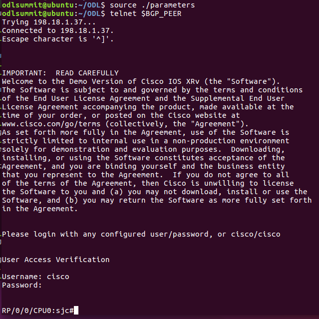
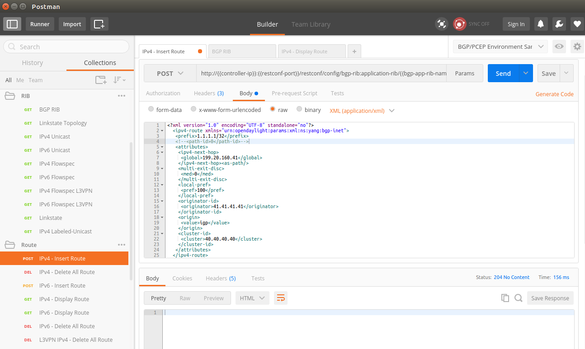
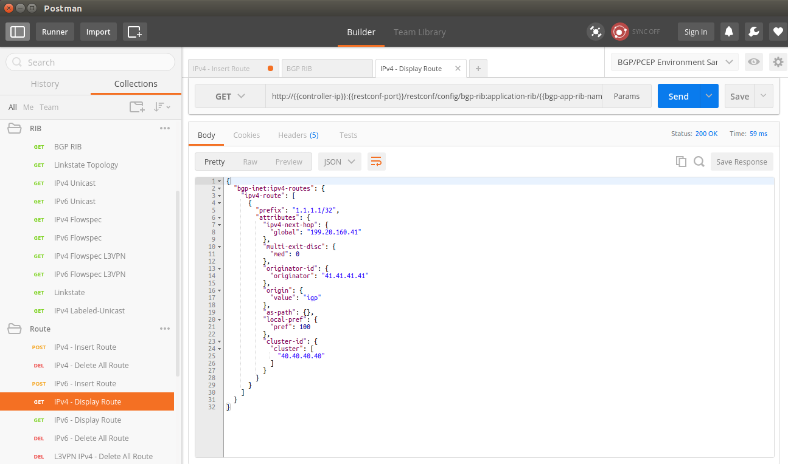
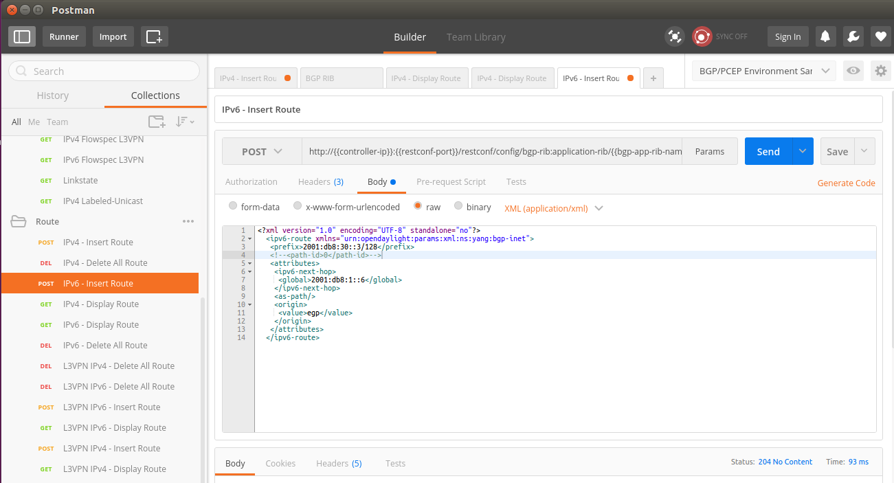

# Configure BGP on ODL
This part of the tutorial we will introduce how to use ODL to set up BGP session with a router.

## Prerequisite
### Install BGP Feature on ODL

To install BGP feature, you need to enter karaf client with command `bin/karaf-client` first, then run the following command:

`feature:install odl-bgpcep-bgp`

> If you are using the default *parameters* files provided by this project, the *odl-bgpcep-bgp* feature will be installed by default.

### Verify BGP Feature
After installing BGP feature, you should be able to see the bgp feature listed in the "installed feature" list.  You can simply verify it with command:

`feature:list -i | grep odl-bgpcep-bgp`

You should be able to see all the BGP related modules get installed.


Besides, you can also verify if BGP feature is functioning properly by accessing the BGP RESTCONF interface.  Simply checking if BGP RIB is returning the correct topology will be enough.

> You can find the corresponding RESTCONF request in provided Postman collection.

 

### Debug
In case you want to observe the internals of BGP feature, you can turn on the DEBUG option in karaf console to see more detailed karaf log output with BGP debug information:

```
log:set DEBUG org.opendaylight.bgpcep.bgp
log:set DEBUG org.opendaylight.protocol.bgp
```

## Change BGP Configurations

To add/edit BGP peers, you will need to change a few BGP configuration files.  These files are managed by the config subsystem of ODL.  They are loaded when the ODL is started.

A much detailed guide exists in [OpenDayLight BGPCEP project wiki](https://wiki.opendaylight.org/view/BGP_LS_PCEP:Main).  Read the **User Guide** of the corresponding ODL version which you are using.

In this tutorial, we are playing with the Beryllium version of ODL.  So you should be looking at the [Beryllium User Guide](https://wiki.opendaylight.org/view/BGP_LS_PCEP:Beryllium_User_Guide).
 
### Change 41-bgp-config-example.xml

The BGP peer configuration is located in file `etc/opendaylight/karaf/41-bgp-example.xml` under ODL directory.

> In this turotial, we are installing ODL under directory `distribution/odl`. So the complete file path should be `distribution/odl/etc/opendaylight/karaf/41-bgp-example.xml`

To edit the configuration file, use the following command in your bash shell:

`gedit distribution/odl/etc/opendaylight/karaf/41-bgp-example.xml >/dev/null 2>&1 &`

#### Update BGP RIB

Find the following section in the 41-bgp-example.xml:

```
                <module>
                    <type xmlns:prefix="urn:opendaylight:params:xml:ns:yang:controller:bgp:rib:impl">prefix:rib-impl</type>
                    ...
                </module>
```

Change the related fields to fit your need.  In this tutorial, we need to change **local-as** field to **65504**.  You should change **bgp-rib-id** to the real IP of your local controller (which you can find with script `bin/check-vpn-status`).

A sample configuration is displayed as follows:

```
                <module>
                    <type xmlns:prefix="urn:opendaylight:params:xml:ns:yang:controller:bgp:rib:impl">prefix:rib-impl</type>
                    <name>example-bgp-rib</name>
                    <rib-id>example-bgp-rib</rib-id>
                    <local-as>65504</local-as>
                    <bgp-rib-id>127.0.0.1</bgp-rib-id>
                    <!-- if cluster-id is not present, it's value is the same as bgp-id -->
                    <!-- <cluster-id>192.0.2.3</cluster-id> -->
                    <local-table>
                        <type xmlns:prefix="urn:opendaylight:params:xml:ns:yang:controller:bgp:rib:impl">prefix:bgp-table-type</type>
                        <name>ipv4-unicast</name>
                    </local-table>
                    <local-table>
                        <type xmlns:prefix="urn:opendaylight:params:xml:ns:yang:controller:bgp:rib:impl">prefix:bgp-table-type</type>
                        <name>ipv6-unicast</name>
                    </local-table>
                    <local-table>
                        <type xmlns:prefix="urn:opendaylight:params:xml:ns:yang:controller:bgp:rib:impl">prefix:bgp-table-type</type>
                        <name>linkstate</name>
                    </local-table>
                    <local-table>
                        <type xmlns:prefix="urn:opendaylight:params:xml:ns:yang:controller:bgp:rib:impl">prefix:bgp-table-type</type>
                        <name>ipv4-flowspec</name>
                    </local-table>
                    <local-table>
                        <type xmlns:prefix="urn:opendaylight:params:xml:ns:yang:controller:bgp:rib:impl">prefix:bgp-table-type</type>
                        <name>ipv6-flowspec</name>
                    </local-table>
                    <local-table>
                        <type xmlns:prefix="urn:opendaylight:params:xml:ns:yang:controller:bgp:rib:impl">prefix:bgp-table-type</type>
                        <name>labeled-unicast</name>
                    </local-table>
                    <extensions>
                        <type xmlns:ribspi="urn:opendaylight:params:xml:ns:yang:controller:bgp:rib:spi">ribspi:extensions</type>
                        <name>global-rib-extensions</name>
                    </extensions>
                    <bgp-dispatcher>
                        <type xmlns:prefix="urn:opendaylight:params:xml:ns:yang:controller:bgp:rib:impl">prefix:bgp-dispatcher</type>
                        <name>global-bgp-dispatcher</name>
                    </bgp-dispatcher>
                    <data-provider>
                        <type xmlns:binding="urn:opendaylight:params:xml:ns:yang:controller:md:sal:binding">binding:binding-async-data-broker</type>
                        <name>pingpong-binding-data-broker</name>
                    </data-provider>
                    <dom-data-provider>
                        <type xmlns:sal="urn:opendaylight:params:xml:ns:yang:controller:md:sal:dom">sal:dom-async-data-broker</type>
                        <name>pingpong-broker</name>
                    </dom-data-provider>
                    <codec-tree-factory>
                        <type xmlns:binding="urn:opendaylight:params:xml:ns:yang:controller:md:sal:binding">binding:binding-codec-tree-factory</type>
                        <name>runtime-mapping-singleton</name>
                    </codec-tree-factory>
                    <session-reconnect-strategy>
                        <type xmlns:prefix="urn:opendaylight:params:xml:ns:yang:controller:protocol:framework">prefix:reconnect-strategy-factory</type>
                        <name>example-reconnect-strategy-factory</name>
                    </session-reconnect-strategy>
                    <tcp-reconnect-strategy>
                        <type xmlns:prefix="urn:opendaylight:params:xml:ns:yang:controller:protocol:framework">prefix:reconnect-strategy-factory</type>
                        <name>example-reconnect-strategy-factory</name>
                    </tcp-reconnect-strategy>
                    <openconfig-provider>
                        <type xmlns:prefix="urn:opendaylight:params:xml:ns:yang:controller:bgp-openconfig-spi">prefix:bgp-openconfig-provider</type>
                        <name>openconfig-bgp</name>
                    </openconfig-provider>
                </module>
```

#### Update BGP Peer

Find the following section in 41-bgp-example.xml:

```
                <module>
                    <type xmlns:prefix="urn:opendaylight:params:xml:ns:yang:controller:bgp:rib:impl">prefix:bgp-peer</type>
                    ...
                </module>
```

By default, the whole section is commentted out, so ODL is not expecting any BGP peer connecting to it.  We need to uncomment the whole section first, then change the BGP peer **host** IP in the section.  As we are peering with SJC router in dCloud, we are going to use its IP (198.18.1.37) here.
An example is shown as follows:

```
                <module>
                    <type xmlns:prefix="urn:opendaylight:params:xml:ns:yang:controller:bgp:rib:impl">prefix:bgp-peer</type>
                    <name>example-bgp-peer</name>
                    <host>198.18.1.37</host>
                    <holdtimer>180</holdtimer>
                    <peer-role>ibgp</peer-role>
                    <rib>
                        <type xmlns:prefix="urn:opendaylight:params:xml:ns:yang:controller:bgp:rib:impl">prefix:rib-instance</type>
                        <name>example-bgp-rib</name>
                    </rib>
                    <peer-registry>
                        <type xmlns:prefix="urn:opendaylight:params:xml:ns:yang:controller:bgp:rib:impl">prefix:bgp-peer-registry</type>
                        <name>global-bgp-peer-registry</name>
                    </peer-registry>
                    <advertized-table>
                        <type xmlns:prefix="urn:opendaylight:params:xml:ns:yang:controller:bgp:rib:impl">prefix:bgp-table-type</type>
                        <name>ipv4-unicast</name>
                    </advertized-table>
                    <advertized-table>
                        <type xmlns:prefix="urn:opendaylight:params:xml:ns:yang:controller:bgp:rib:impl">prefix:bgp-table-type</type>
                        <name>ipv6-unicast</name>
                    </advertized-table>
                    <advertized-table>
                        <type xmlns:prefix="urn:opendaylight:params:xml:ns:yang:controller:bgp:rib:impl">prefix:bgp-table-type</type>
                        <name>linkstate</name>
                    </advertized-table>
                    <advertized-table>
                        <type xmlns:prefix="urn:opendaylight:params:xml:ns:yang:controller:bgp:rib:impl">prefix:bgp-table-type</type>
                        <name>ipv4-flowspec</name>
                    </advertized-table>
                    <advertized-table>
                        <type xmlns:prefix="urn:opendaylight:params:xml:ns:yang:controller:bgp:rib:impl">prefix:bgp-table-type</type>
                        <name>ipv6-flowspec</name>
                    </advertized-table>
                    <advertized-table>
                        <type xmlns:prefix="urn:opendaylight:params:xml:ns:yang:controller:bgp:rib:impl">prefix:bgp-table-type</type>
                        <name>labeled-unicast</name>
                    </advertized-table>
                </module>
```

#### Update BGP Application Peer

The application peer configuration doesn't exist in the 41-bgp-example.xml file by default.  So you should add it after the BGP peer section.

Remember to change the **bgp-peer-id** to your local controller's real IP.

```
                <module xmlns="urn:opendaylight:params:xml:ns:yang:controller:config">
                    <type xmlns:x="urn:opendaylight:params:xml:ns:yang:controller:bgp:rib:impl">x:bgp-application-peer</type>
                    <name>example-bgp-peer-app</name>
                    <bgp-peer-id xmlns="urn:opendaylight:params:xml:ns:yang:controller:bgp:rib:impl">127.0.0.1</bgp-peer-id> 
                    <target-rib xmlns="urn:opendaylight:params:xml:ns:yang:controller:bgp:rib:impl">
                        <type xmlns:x="urn:opendaylight:params:xml:ns:yang:controller:bgp:rib:impl">x:rib-instance</type>
                        <name>example-bgp-rib</name>
                    </target-rib>
                    <application-rib-id xmlns="urn:opendaylight:params:xml:ns:yang:controller:bgp:rib:impl">example-app-rib</application-rib-id>
                    <data-broker xmlns="urn:opendaylight:params:xml:ns:yang:controller:bgp:rib:impl">
                        <type xmlns:x="urn:opendaylight:params:xml:ns:yang:controller:md:sal:dom">x:dom-async-data-broker</type>
                        <name>pingpong-broker</name>
                    </data-broker>
                </module>
```

### Restart OpenDayLight

To let ODL reload the config xml files, you will have to restart OpenDayLight.  You can restart ODL by running the two scripts provided by the project:

```
./bin/stop-odl
./bin/start-odl
```

You can monitor the karaf log either by running command `log:tail` in karaf console, or run the script provided `bin/tail-log`.

## Peer with XRv in dCloud Lab

Now, after you finishing configuring the BGP peer, you need to configure the XRv in Cisco dCloud lab so that they can connect to each other.

First, you need to telnet to the XRv in dCloud:




```
 neighbor 198.18.1.80
  remote-as 65504
  update-source MgmtEth0/0/CPU0/0
  address-family ipv4 unicast
   route-reflector-client
  !
  address-family link-state link-state
   route-reflector-client
  !       
 !
```

**198.18.1.80** is the IP of the OpenDayLight controller hosted in Cisco dCloud.  As we are using our own controller for the tutorial, we want to replace the IP with our own controller's IP.

```
configure terminal
router bgp 65504
 no neighbor 198.18.1.80
 
 neighbor 1.2.3.4
  remote-as 65504
  update-source MgmtEth0/0/CPU0/0
  address-family ipv4 unicast
   route-reflector-client
  !
  address-family link-state link-state
   route-reflector-client
  !       
 !
commit
```

Replace the **1.2.3.4** with your local controller's IP (the VPN tunnel's IP)

Again, you can get your controller's real IP with script `./bin/check-vpn-status`

## Verify BGP RIB Information

After peering with the routers in dCloud, you should be able to see BGP peer information in controller.  There are two ways you can check if the peering is successful.

1. You can check the karaf log of your controller. Simply use the script provided `bin/tail-log`:

	```
2016-09-10 00:16:38,109 | INFO  | oupCloseable-2-1 | StrictBGPPeerRegistry            | 236 - org.opendaylight.bgpcep.bgp-rib-impl - 0.5.3.Beryllium-SR3 | BGP Open message session parameters differ, session still accepted.
2016-09-10 00:16:38,117 | INFO  | oupCloseable-2-1 | BGPSessionImpl                   | 236 - org.opendaylight.bgpcep.bgp-rib-impl - 0.5.3.Beryllium-SR3 | BGP HoldTimer new value: 180
2016-09-10 00:16:38,152 | INFO  | oupCloseable-2-1 | BGPPeer                          | 236 - org.opendaylight.bgpcep.bgp-rib-impl - 0.5.3.Beryllium-SR3 | Session with peer 198.18.1.37 went up with tables: [BgpTableTypeImpl [getAfi()=class org.opendaylight.yang.gen.v1.urn.opendaylight.params.xml.ns.yang.bgp.types.rev130919.Ipv4AddressFamily, getSafi()=class org.opendaylight.yang.gen.v1.urn.opendaylight.params.xml.ns.yang.bgp.types.rev130919.UnicastSubsequentAddressFamily], BgpTableTypeImpl [getAfi()=class org.opendaylight.yang.gen.v1.urn.opendaylight.params.xml.ns.yang.bgp.linkstate.rev150210.LinkstateAddressFamily, getSafi()=class org.opendaylight.yang.gen.v1.urn.opendaylight.params.xml.ns.yang.bgp.linkstate.rev150210.LinkstateSubsequentAddressFamily]]
2016-09-10 00:16:38,285 | INFO  | oupCloseable-2-1 | AbstractBGPSessionNegotiator     | 236 - org.opendaylight.bgpcep.bgp-rib-impl - 0.5.3.Beryllium-SR3 | BGP Session with peer [id: 0xfdcbed33, L:/10.16.22.180:37480 - R:/198.18.1.37:179] established successfully.
2016-09-10 00:16:45,640 | INFO  | oupCloseable-2-1 | BGPSynchronization               | 236 - org.opendaylight.bgpcep.bgp-rib-impl - 0.5.3.Beryllium-SR3 | BGP Synchronization finished for table TablesKey [_afi=class org.opendaylight.yang.gen.v1.urn.opendaylight.params.xml.ns.yang.bgp.linkstate.rev150210.LinkstateAddressFamily, _safi=class org.opendaylight.yang.gen.v1.urn.opendaylight.params.xml.ns.yang.bgp.linkstate.rev150210.LinkstateSubsequentAddressFamily] 
2016-09-10 00:16:46,041 | INFO  | oupCloseable-2-1 | BGPSynchronization               | 236 - org.opendaylight.bgpcep.bgp-rib-impl - 0.5.3.Beryllium-SR3 | BGP Synchronization finished for table TablesKey [_afi=class org.opendaylight.yang.gen.v1.urn.opendaylight.params.xml.ns.yang.bgp.types.rev130919.Ipv4AddressFamily, _safi=class org.opendaylight.yang.gen.v1.urn.opendaylight.params.xml.ns.yang.bgp.types.rev130919.UnicastSubsequentAddressFamily] 
	```

2. Check through RESTCONF.  You can check if BGP RIB is showing the routes broadcasted by the remote router (the response could be big, so actual text response is not pasted here):

	

## Inject Route

With OpenDayLight, you can easily inject routes to remote BGP routers via RESTCONF.

### Inject IPv4 unicast routes





### Inject IPv6 unicast routes




### Delete Injected Route

It is also possible to delete injected route via RESTCONF.  Please check the provided Postman collection.