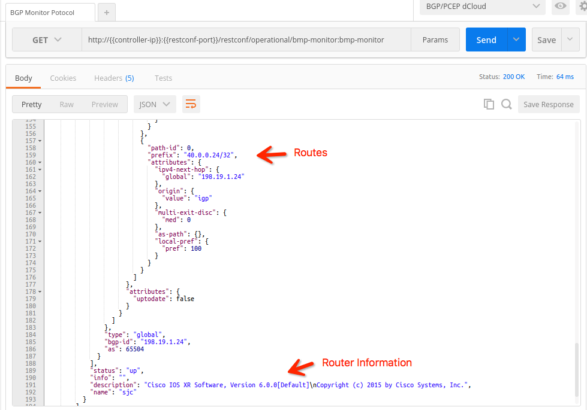

# Configure BMP
BGP Monitor Protocol (BMP) is a protocol used to monitor BGP sessions.  It is intended to provided a convenient interface for obtaining route views.  The protocol is defined by [RFC 7854](https://tools.ietf.org/html/rfc7854).

## Install BMP Feature on ODL
To use BMP feature on ODL, you will need to install it in ODL karaf console first.  The BMP is not a part of `odl-bgpcep-bgp` feature, so you will need to install it seperately.

To install BMP feature, you need to log in to the karaf console using the script provided (`bin/karaf-client`).  Then run `feature:install odl-bgpcep-bmp`.

> If you are using the default *parameters* files provided by this project, the *odl-bgpcep-bmp* feature will be installed by default.

## Verify BMP is Installed

To verify BMP feature install correctly on ODL, simply accessing the BMP RESTCONF API (RESTCONF request is included in the Postman collection provided).  You should be able to see the similiar response as following:

```
{
  "bmp-monitor": {
    "monitor": [
      {
        "monitor-id": "example-bmp-monitor"
      }
    ]
  }
}
```

## Configure BMP on ODL
After the BMP feature is installed on ODL, a `42-bmp-example.xml` file will be created under directory `distribution/odl/etc/opendaylight/karaf/`.

The file is used to configure the BMP feature.  You can change the **binding-port** for BMP listening port on ODL.  You can also edit a list of **monitored-router** if the router you want to monitor has password enabled for BMP protocol.  You can also clearly ask ODL to **actively** conntect to the **monitored-router** in the setting.

In the tutorial, there is no need to edit this file.  You can proceed to the next step directly.

## Configure XRv Router
To view BMP data on ODL, you need to enable BMP reporting on BGP routers.  In this tutorial, we are trying to view the BGP session status of SJC site.

1. Connect to the console of SJC router with command `telnet $ROUTER_NODE_SJC`.

2. Enter the configuration mode: `configure terminal`.

3. To let XRv router report BMP to the controller, you need to configure a bmp server.

	```
	bmp server 1
	 host 10.16.49.227 port 12345
	 description ODL
	!
	```
	
	> **NOTE** You should replace the IP **10.16.49.227** with your controller's real IP.  Your controller's IP can be fetched with script `bin/check-vpn-status`

4. Then you need to configure which BGP session you want to report with BMP.  For whichever BGP session you want to report, simply put the command `bmp-activate server 1` to point it to the controller.

	For example, if we want to report the BGP session between SJC site and node **198.19.1.24**, you should put `bmp-activate server 1` under the configuration of `neighbor 198.19.1.24`.  An example configuration is shown as follows:
	
	```
	 ...
	  address-family ipv4 unicast
	   route-reflector-client
	  !
	 !
	 neighbor 198.19.1.24
	  remote-as 65504
	  bmp-activate server 1
	  update-source Loopback0
	  address-family ipv4 unicast
	   route-reflector-client
	  !
	 !
	 neighbor 198.19.1.26
	  remote-as 65504
	 ...
	```

	After the configuration change is made, remember to **commit** so that your configuration will be effective.
	
5. Finally, you can check the RESTCONF content again to see the BMP information.

	> **NOTE** You may need to wait for a few seconds to see the BMP information get synchronized to the controller.
	
	You are supposed to see the following response if your change is done successfully:
	
	
	
	