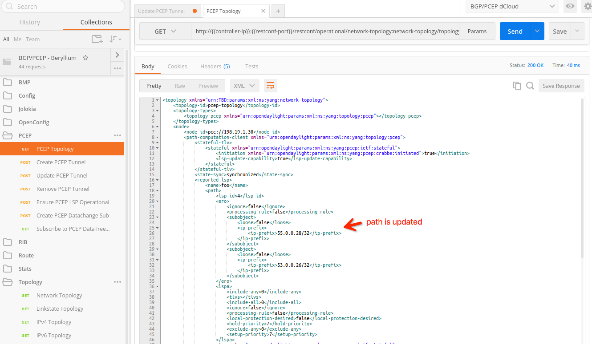

# Configure PCEP on ODL
This part of the tutorial we will introduce how to use ODL to set up PCEP session with a router.

## Prerequsite
### Install PCEP Feature in ODL
To install the PCEP feature in the controller, you will need to log into the karaf console.  Of course, you need to make sure the controller is installed and running.  You can use the provided script `bin/start-odl` to start controller.  After the controller is started, you can run `bin/karaf-client` to enter the karaf console.

To install PCEP feature, you need to type the following command into the console:

`feature:install odl-bgpcep-pcep`

After installing the *odl-bgpcep-pcep* feature, you can logout the karaf console with **CTRL** + **D**, or type `logout`.

> If you are using the default *parameters* files provided by this project, the *odl-bgpcep-pcep* feature will be installed by default.

> You **DO NOT** need to change any config subsystem xml files in order to peer the controller with other routers.

### Debug
Optionally, you can turn on the DEBUG option in karaf console to see more detailed karaf log output with PCEP debug information:

```
log:set DEBUG org.opendaylight.bgpcep.cep
log:set DEBUG org.opendaylight.protocol.pcep
```

You can monitor the karaf log either by running command `log:tail` in karaf console, or run the script provided `bin/tail-log`.

### Configure Cisco XRv in dCloud Lab
To peer a Cisco XRv with local controller, you will need to login to the console of that specific XRv.  You can find a list of IPs by looking at the [nodes](../../nodes) file.

In this tutorial, we are going to establish a LSP between SJC site and POR site.  We are going to peer SJC site's XRv with our local controller, so that we can control the LSP via ODL.

> You can also choose to establish a LSP between other sites.  All the XRv routers in Cisco dCloud lab has PCEP capability.  The steps to peer them with the controller will be similiar.

1. First, you need to telnet to the XRv console.  As we are picking SJC XRv in this tutorial, you can reach to the XRv with the following command:

	```
	source ./nodes
	telnet $ROUTER_NODE_SJC
	```
	The usename and password of the XRv is default to **cisco** / **cisco** .
	
2. After login to the console, you can see the existing running config with command `show running-config`.  At the bottom of the configuration, you should be able to see a section of **mpls traffic-eng** configuration (shown as following).
	
	

	The existing configuration shoule be similiar as this:
	
	```
	 pce
	  peer ipv4 198.18.1.80
	  !
	  segment-routing
	  stateful-client
	   instantiation
	   cisco-extension
	  !
	 !
	```

	The existing IP `198.18.1.80` is the IP of the remote controller sitting in the Cisco dCloud lab.  We want to replace the IP with our own controller's IP.  You can grab the local controller IP with script `bin/check-vpn-status`.
	
	To change the configuration, you need to enter the configuration terminal with command `configure terminal`.  Then you should type the following command to change the configuration.
	
	```
	mpls traffic-eng
	 pce
	  no peer ipv4 198.18.1.80
	  peer ipv4 1.2.3.4
	  !
	  stateful-client
	    no cisco-extension
	 !
	!
	```
	> *  Replace **1.2.3.4** with your local controller's IP
	> * **cisco-extension** is not needed in our experiment, so we disable it here

	At last type `commit` to save the change.

3. After the change, you should be able to see the following configuration with command `show running-config mpls traffic-eng` (the **1.2.3.4** in the following configuration should be your controller's IP instead)

	```
	mpls traffic-eng
	 interface GigabitEthernet0/0/0/0
	 !
	 interface GigabitEthernet0/0/0/1
	 !
	 interface GigabitEthernet0/0/0/2
	 !
	 interface GigabitEthernet0/0/0/3
	 !
	 interface GigabitEthernet0/0/0/4
	 !
	 pce
	  peer ipv4 1.2.3.4
	  !
	  segment-routing
	  stateful-client
	   instantiation
	  !
	 !
	 auto-tunnel pcc
	  tunnel-id min 1 max 99
	 !
	 reoptimize timers delay installation 0
	!
	```

### Verify PCC is Connected to Controller
After you configure the router, the controller should have been peered with your router.  You can look at the karaf log of your controller with command `bin/tail-log`, which will show the last a few lines of karaf log.

You are suppose to see a log like the following:

```
2016-09-10 01:26:49,756 | INFO  | oupCloseable-2-3 | PCEPSessionNegotiator            | 288 - org.opendaylight.bgpcep.pcep-impl - 0.5.3.Beryllium-SR3 | Replacing bootstrap negotiator for channel [id: 0xe72db829, L:/10.16.22.180:4189 - R:/198.18.1.37:26749]
2016-09-10 01:26:49,760 | INFO  | oupCloseable-2-3 | AbstractPCEPSessionNegotiator    | 288 - org.opendaylight.bgpcep.pcep-impl - 0.5.3.Beryllium-SR3 | PCEP session with [id: 0xe72db829, L:/10.16.22.180:4189 - R:/198.18.1.37:26749] started, sent proposal Open [_deadTimer=120, _keepalive=30, _sessionId=0, _tlvs=Tlvs [augmentation=[Tlvs1 [_stateful=Stateful [_lspUpdateCapability=true, augmentation=[Stateful1 [_initiation=true], Stateful1 [_deltaLspSyncCapability=true, _includeDbVersion=true, _triggeredInitialSync=true, _triggeredResync=true]]]], Tlvs1 [_srPceCapability=SrPceCapability [_msd=0, augmentation=[]]]]], augmentation=[]]
2016-09-10 01:26:49,850 | INFO  | oupCloseable-2-3 | AbstractPCEPSessionNegotiator    | 288 - org.opendaylight.bgpcep.pcep-impl - 0.5.3.Beryllium-SR3 | PCEP peer [id: 0xe72db829, L:/10.16.22.180:4189 - R:/198.18.1.37:26749] completed negotiation
2016-09-10 01:26:49,850 | INFO  | oupCloseable-2-3 | PCEPSessionImpl                  | 288 - org.opendaylight.bgpcep.pcep-impl - 0.5.3.Beryllium-SR3 | Session /10.16.22.180:4189[0] <-> /198.18.1.37:26749[1] started
2016-09-10 01:26:49,865 | INFO  | oupCloseable-2-3 | AbstractTopologySessionListener  | 301 - org.opendaylight.bgpcep.pcep-topology-provider - 0.5.3.Beryllium-SR3 | Session with /198.18.1.37 attached to topology node KeyedInstanceIdentifier{targetType=interface org.opendaylight.yang.gen.v1.urn.tbd.params.xml.ns.yang.network.topology.rev131021.network.topology.topology.Node, path=[org.opendaylight.yang.gen.v1.urn.tbd.params.xml.ns.yang.network.topology.rev131021.NetworkTopology, org.opendaylight.yang.gen.v1.urn.tbd.params.xml.ns.yang.network.topology.rev131021.network.topology.Topology[key=TopologyKey [_topologyId=Uri [_value=pcep-topology]]], org.opendaylight.yang.gen.v1.urn.tbd.params.xml.ns.yang.network.topology.rev131021.network.topology.topology.Node[key=NodeKey [_nodeId=Uri [_value=pcc://198.18.1.37]]]]}
```

It basically describes how the PCC (router) is registered to PCE (controller).

If you pull the PCEP topology via RESTCONF, you should be able to see a result like the following:


> Note the **node-id** will be shown as **192.19.1.30**, which is the Loopback0 address of the XRv.  You can configure XRv to overwrite the node-id with command: `mpls traffic-eng pce peer source ipv4 198.18.1.37`, where **198.18.1.37** is the IP of SJC router.

## Establish LSP

The topology in the dCloud lab is shown as the following picture:


In the following examples, we are going to establish LSP from SJC site to POR site.  There are two routes from SJC site (198.19.1.30) to POR site (198.19.1.26):

* SJC (*55.0.0.30* | GigabitEthernet0/0/0/3) -> SEA (**55.0.0.28** | GigabitEthernet0/0/0/3) -> SEA (*53.0.0.28* | GigabitEthernet0/0/0/2) -> POR (**53.0.0.26** | GigabitEthernet0/0/0/1) -> POR (*198.19.1.26* | Loopback0)

* SJC (*56.0.0.30* | GigabitEthernet0/0/0/4) -> SFC (**56.0.0.29** | GigabitEthernet0/0/0/2) -> SFC (*54.0.0.29* | GigabitEthernet0/0/0/1) -> POR (**54.0.0.26** | GigabitEthernet0/0/0/2) -> POR (*198.19.1.26* | Loopback0)

### Create PCE-initiated LSP

To create a PCE-initiated LSP, you can simply submit a RESTCONF request through the controller.  You should be able to find a RESTCONF request from the provided Postman collection:


> The path and other fields in the request body are pre-filled.  You should check the Postman environment to check/change the exact value.

After the RESTCONF request is submitted, you are suppose to see a 200 OK response at the bottom.  Also, to make sure the LSP is truely created, you should do a GET request on the PCEP topology from controller:


You should see the LSP gets established successfully, and the fields such as path, source and destination should match what we filled in the request.

Optionally, you can double check the tunnel status from XRv.  From the XRv console, you should be able to see the similiar response as following with command `show mpls traffic-eng tunnels` (you need to exit the EXEC mode first)

```
Name: tunnel-te1  Destination: 198.19.1.26  Ifhandle:0x880 (auto-tunnel pcc)
  Signalled-Name: foo
  Status:
    Admin:    up Oper:   up   Path:  valid   Signalling: connected

    path option 10, (verbatim) type explicit (autopcc_te1) (Basis for Setup, path weight 0)
    G-PID: 0x0800 (derived from egress interface properties)
    Bandwidth Requested: 0 kbps  CT0
    Creation Time: Sun Sep 11 09:40:49 2016 (00:08:28 ago)
  Config Parameters:
    Bandwidth:        0 kbps (CT0) Priority:  7  7 Affinity: 0x0/0xffff
    Metric Type: TE (default)
    Path Selection:
      Tiebreaker: Min-fill (default)
    Hop-limit: disabled
    Cost-limit: disabled
    Path-invalidation timeout: 10000 msec (default), Action: Tear (default)
    AutoRoute: disabled  LockDown: disabled   Policy class: not set
    Forward class: 0 (default)
    Forwarding-Adjacency: disabled
    Loadshare:          0 equal loadshares
    Auto-bw: disabled
    Fast Reroute: Disabled, Protection Desired: None
    Path Protection: Not Enabled
    BFD Fast Detection: Disabled
    Reoptimization after affinity failure: Enabled
    Soft Preemption: Disabled
  Auto PCC: 
    Symbolic name: foo
    PCEP ID: 2
    Delegated to: 10.16.22.180
    Created by: 10.16.22.180
  History:
    Tunnel has been up for: 00:08:27 (since Sun Sep 11 09:40:50 UTC 2016)
    Current LSP:
      Uptime: 00:08:27 (since Sun Sep 11 09:40:50 UTC 2016)

  Path info (PCE controlled):
  Hop0: 56.0.0.29
  Hop1: 54.0.0.26
Displayed 1 (of 1) heads, 0 (of 0) midpoints, 0 (of 0) tails
Displayed 1 up, 0 down, 0 recovering, 0 recovered heads
```

You can see from the **Auto PCC** section, this tunnel is **Delegated to** and **Created by** the controller (PCE).  At last, the path information is listed.

You should also pay attention to the **Status** at the top.  A properly created LSP should have a **valid** path and **connected** signalling, which means the path is usable.

## Verify Tunnel Connectivity

`mpls traffic-eng auto-bw collect frequency 1`

`ping 198.19.1.26 source 198.19.1.30 count 10000 size 18024`


## Remove PCE-initiated LSP
To remove a PCE-initiated LSP, simply submit a DELETE request via RESTCONF.  You can find relate HTTP request from Postman collection provided:


## Create PCC-initiated LSP

To create a PCC-initiated LSP, you will need to configure the LSP information via XRv console.

Enter the follwing command on the SJC XRv in EXEC mode (type `configure terminal` to enter):

```
interface tunnel-te100
 ipv4 unnumbered Loopback0
 signalled-name foo
 autoroute announce
 !
 destination 198.19.1.26
 path-option 1 dynamic
!
```

The above command tell the PCC (XRv) to establish a LSP between Loopback0 (SJC site) and destination 198.19.1.26 (Loopback0 of POR site). `path-option 1 dynamic` tells PCC to calculate the LSP path based on routing information.

After changing the command, type `commit` to save the change.

At last, verify the status of LSP with command: 
`show mpls traffic-eng tunnels`

You should be able to see similar output as follows:

```
Name: tunnel-te100  Destination: 198.19.1.26  Ifhandle:0x580 
  Signalled-Name: foo
  Status:
    Admin:    up Oper:   up   Path:  valid   Signalling: connected

    path option 1,  type dynamic  (Basis for Setup, path weight 20)
    G-PID: 0x0800 (derived from egress interface properties)
    Bandwidth Requested: 0 kbps  CT0
    Creation Time: Sun Sep 11 08:15:24 2016 (00:00:10 ago)
  Config Parameters:
    Bandwidth:        0 kbps (CT0) Priority:  7  7 Affinity: 0x0/0xffff
    Metric Type: TE (default)
    Path Selection:
      Tiebreaker: Min-fill (default)
    Hop-limit: disabled
    Cost-limit: disabled
    Path-invalidation timeout: 10000 msec (default), Action: Tear (default)
    AutoRoute:  enabled  LockDown: disabled   Policy class: not set
    Forward class: 0 (default)
    Forwarding-Adjacency: disabled
    Loadshare:          0 equal loadshares
    Auto-bw: disabled
    Fast Reroute: Disabled, Protection Desired: None
    Path Protection: Not Enabled
    BFD Fast Detection: Disabled
    Reoptimization after affinity failure: Enabled
    Soft Preemption: Disabled
  History:
    Tunnel has been up for: 00:00:09 (since Sun Sep 11 08:15:25 UTC 2016)
    Current LSP:
      Uptime: 00:00:09 (since Sun Sep 11 08:15:25 UTC 2016)

  Path info (IS-IS pce-poc level-2):
  Node hop count: 2
  Hop0: 56.0.0.29
  Hop1: 54.0.0.26
  Hop2: 198.19.1.26
Displayed 1 (of 1) heads, 0 (of 0) midpoints, 0 (of 0) tails
Displayed 1 up, 0 down, 0 recovering, 0 recovered heads
RP/0/0/CPU0:sjc#
```

You can see from the **Path info** that the hops are calculated automatically.

### Enable LSP Delegation

You can further delegate the LSP to PCE so that the controller can control the LSP.  Enable the LSP delegation to controller with the command:

```
interface tunnel-te100
 pce
  delegation
 !
```

After the change, the configuration should looks like this:

```
RP/0/0/CPU0:sjc#show running-config interface tunnel-te 100
Sun Sep 11 08:23:16.236 UTC
interface tunnel-te100
 ipv4 unnumbered Loopback0
 signalled-name foo
 autoroute announce
 !
 destination 198.19.1.26
 path-option 1 dynamic
 pce
  delegation
 !
!
```

As we peered the XRv with our controller in previous step, the LSP will be automatically delegted to it.  You can verify the status of the LSP on XRv again.

```
RP/0/0/CPU0:sjc#show mpls traffic-eng tunnels 
Sun Sep 11 08:25:13.636 UTC


Name: tunnel-te100  Destination: 198.19.1.26  Ifhandle:0x580 
  Signalled-Name: foo
  Status:
    Admin:    up Oper:   up   Path:  valid   Signalling: connected

    path option 10, (verbatim) type explicit (autopcc_te100) (Basis for Setup, path weight 0)
    G-PID: 0x0800 (derived from egress interface properties)
    Bandwidth Requested: 0 kbps  CT0
    Creation Time: Sun Sep 11 08:15:24 2016 (00:09:50 ago)
  Config Parameters:
    Bandwidth:        0 kbps (CT0) Priority:  7  7 Affinity: 0x0/0xffff
    Metric Type: TE (default)
    Path Selection:
      Tiebreaker: Min-fill (default)
    Hop-limit: disabled
    Cost-limit: disabled
    Path-invalidation timeout: 10000 msec (default), Action: Tear (default)
    AutoRoute:  enabled  LockDown: disabled   Policy class: not set
    Forward class: 0 (default)
    Forwarding-Adjacency: disabled
    Loadshare:          0 equal loadshares
    Auto-bw: disabled
    Fast Reroute: Disabled, Protection Desired: None
    Path Protection: Not Enabled
    BFD Fast Detection: Disabled
    Reoptimization after affinity failure: Enabled
    Soft Preemption: Disabled
  PCE Delegation: 
    Symbolic name: foo
    PCEP ID: 101
    Delegated to: 10.16.22.180
  History:
    Tunnel has been up for: 00:09:49 (since Sun Sep 11 08:15:25 UTC 2016)
    Current LSP:
      Uptime: 00:02:26 (since Sun Sep 11 08:22:48 UTC 2016)
    Prior LSP:
      ID: 2 Path Option: 10
      Removal Trigger: reoptimization completed

  Path info (PCE controlled):
  Hop0: 56.0.0.29
  Hop1: 54.0.0.26
  Hop2: 198.19.1.26
Displayed 1 (of 1) heads, 0 (of 0) midpoints, 0 (of 0) tails
Displayed 1 up, 0 down, 0 recovering, 0 recovered heads

```

You should be able to see the section **PCE Delegation**, and the **Delegated to** field points to your controller.

The **Path info** at the bottom also shows **PCE controlled**.

Optionally, you can verify the PCEP topology on the controller via RESTCONF.


### Update LSP Information

When the LSP is delegated, we can update the path via controller.  Since in the above PCC-inited LSP, PCE selected the path **56.0.0.29** -> **54.0.0.26**, we can update the LSP to use the alternate path **55.0.0.28** -> **53.0.0.26** in the update request.
> PCE may select a different path for you due to different runtime condition. To experiment with the update LSP request, you should choose to update LSP with a different path.
> **Note** Remember to change the **node** id in the request if you did not announce `pce peer source ipv4 address` in the previous configuration.

Change the Postman request body to use different hops:


After submit the request, you can check the status on XRv:


Also, verify the PCEP topology is successfully updated on the controller as well.



### Revoke LSP Delegation

PCE can return the delegation to PCC for a PCC-initiated LSP.  In order to do that, simply set the **delegate** tag to false in a LSP update reuqest.

> You cannot revoke delegation for a PCE-initiated LSP.  You can submit a LSP update request with **delegate** set to false.  However, the PCE will automatically retake the delegation back whenever it needs to update the LSP.

After returning the delegation, you should check the tunnel status in XRv:


You should see the **PCE Delegation** is not there anymore.

Now pull the PCEP topology via RESTCONF again, you may not see the LSP information again, though it still exist on XRv.
