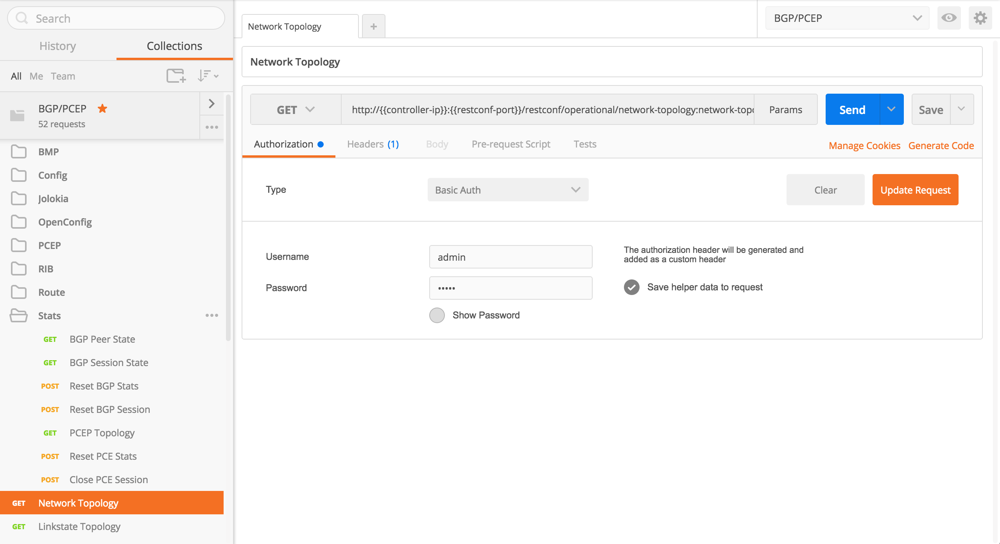

# Configure Postman
Postman is a free tool helping user generate HTTP requests. This guide introduces the basic steps to set up the Postman for accessing ODL Restconf.

## Install Postman
You will need to go to [Postman's official website](https://www.getpostman.com) to download it.  There are multiple versions available on the website.  Choose the one suites your need most.

It is recommend to install the [Postman as Chrome App](https://chrome.google.com/webstore/detail/postman-rest-client/fhbjgbiflinjbdggehcddcbncdddomop), as it is platform unrelated.

After downloading Postman, you either choose to sign up an account or start to use it immediately.

## Import BGPCEP Postman Collection
You can custom your own HTTP request with Postman.  To save your time, we provide a complete BGPCEP Postman collection with this repository.  The collection can be found under [postman-collection folder](../../postman-collection).

There are three files provided:

 * [bgpcep.beryllium.postman_collection.json](../../postman-collection/bgpcep.beryllium.postman_collection.json) and [bgpcep.boron.postman_collection.json](../../postman-collection/bgpcep.boron.postman_collection.json) are HTTP request collections containing most of the HTTP requests related to OpenDayLight BGP/PCEP project.
 
 * [bgpcep.dCloud.postman_environment.json](../../postman-collection/bgpcep.dCloud.postman_environment.json) is a Postman environment file pairing with the provided BGPCEP Postman collections.  It is used to configure the environment variables of HTTP requests.

To import the files, click on the **Import** button on the top-left corner of Postman.

 

You can **Import Folder** to import all three files at one time.  If you have already get the Postman collection imported before, you will need to choose **Replace** when prompted for overwriting your local copy.

After importing, you should be able to see a collection of BGP/PCEP HTTP requests listed (name may vary).

You should also be able to find a Postman environment variable collection named "**BGP/PCEP dCloud**" imported.

## Change Postman Environment Variables
To start to use the provided Postman BGP/PCEP collection, you will need to change the environment variables first.

Find the **gear** button on the top-right corner of Postman, click on it and you will see a list of all the available environments.

Choose the BGP/PCEP one which you just imported and change the variables to meet your needs.  Then click on **Update**.

