# Setup Network Environment

This tutorial is to help you set up the network environment, so you can peer your OpenDayLight controller with virtual routers.

## Network Diagram & Components

Topology of network that we shall be putting together for this tutorial
is depicted below. It comprises of OpenDaylight Controller VM in local
computing environment connected to Cisco Virtual Internet Routing Lab
(VIRL) based network simulation running in Cisco dCloud environment,
over Anyconnect VPN


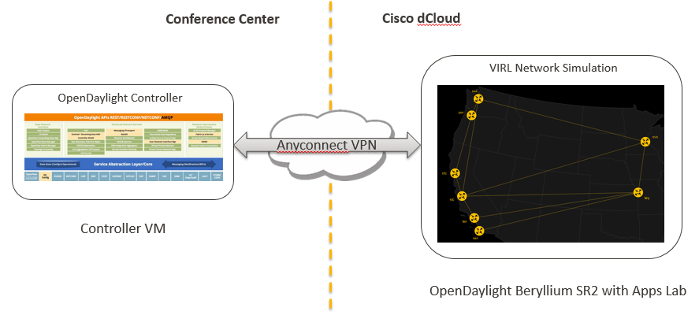

## Start Cisco dCloud environment

Follow below steps to launch the network simulation

### Create an account and login into Cisco dCloud

1.  Open <https://dcloud.cisco.com/> in your browser and click on
    **Login** button
    
	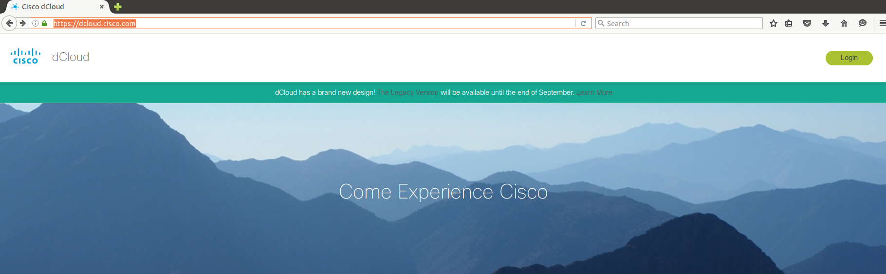
	
2.  If you already have a Cisco account, login using that and start [scheduling a ODL lab](#schedule)
	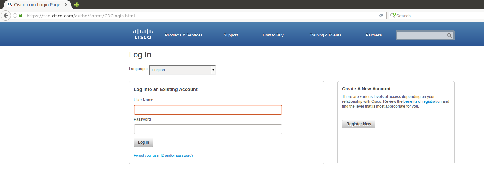
	
	> Optionally click on **Register Now** button to get a free account
    
	> Enter required details and create new account. Login to dCloud
    portal using the new account details

	> 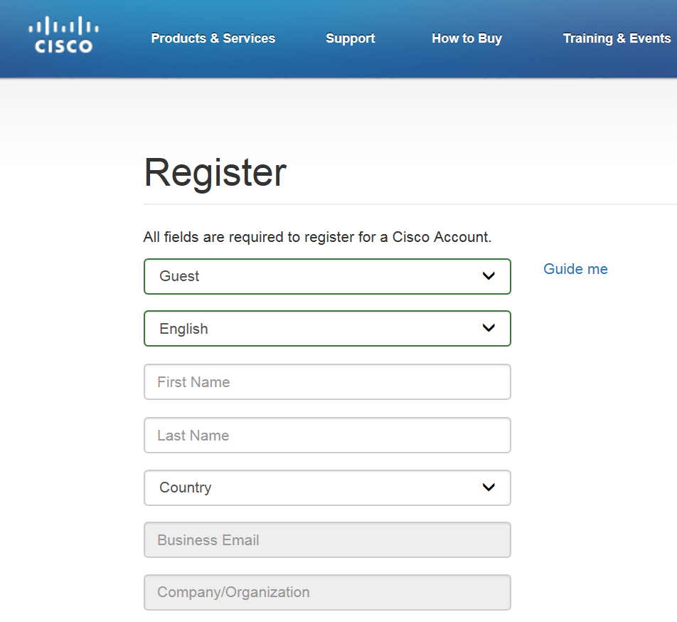

### <a name="schedule">Find and schedule the OpenDaylight lab</a>

1.  Navigate to **Dashboard** **My Sessions** and click on **find
    content**

	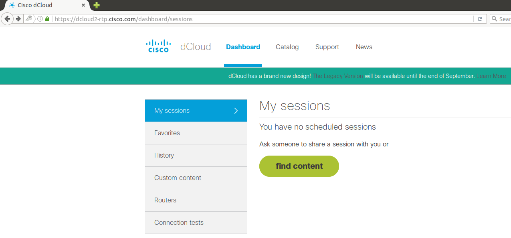

2.  Search Catalog for “OpenDaylight Beryllium SR3 with Apps with 8 Nodes v1”. Then click on **Schedule** button of the lab displayed

	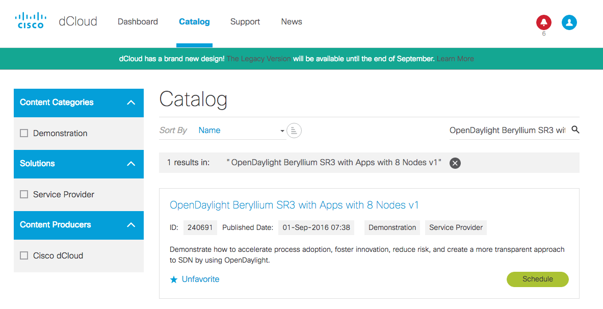
	
4.  Click on **Now** button. By default, the scheduled duration will be 4 hours. Adjust the end time for the desired duration **(min. 5 hours recommended. The max. time your can schedule is 5 days)**. Go to bottom of page and click on **Next**

	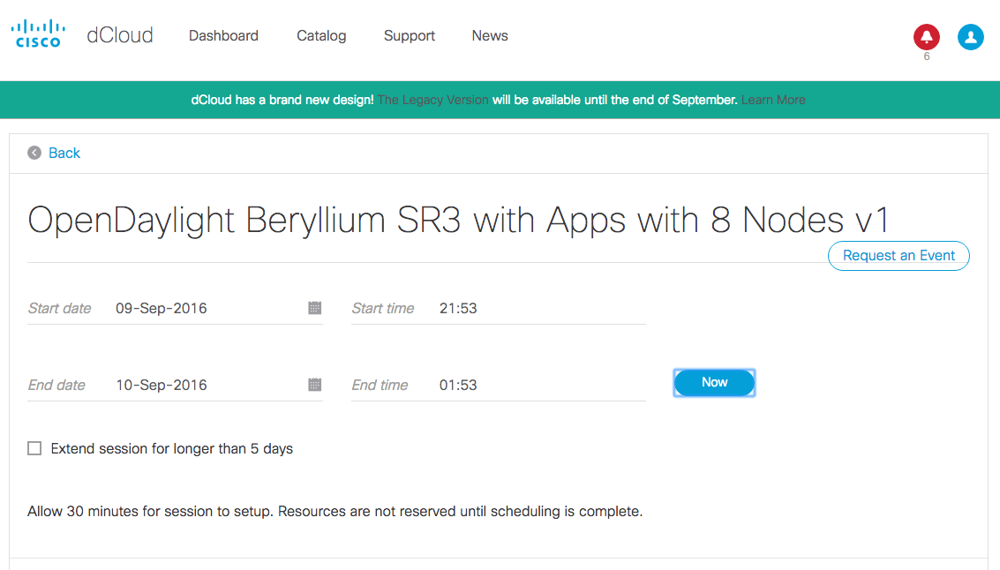

5.  Enter the drop-down values appropriately and click on **Schedule**

	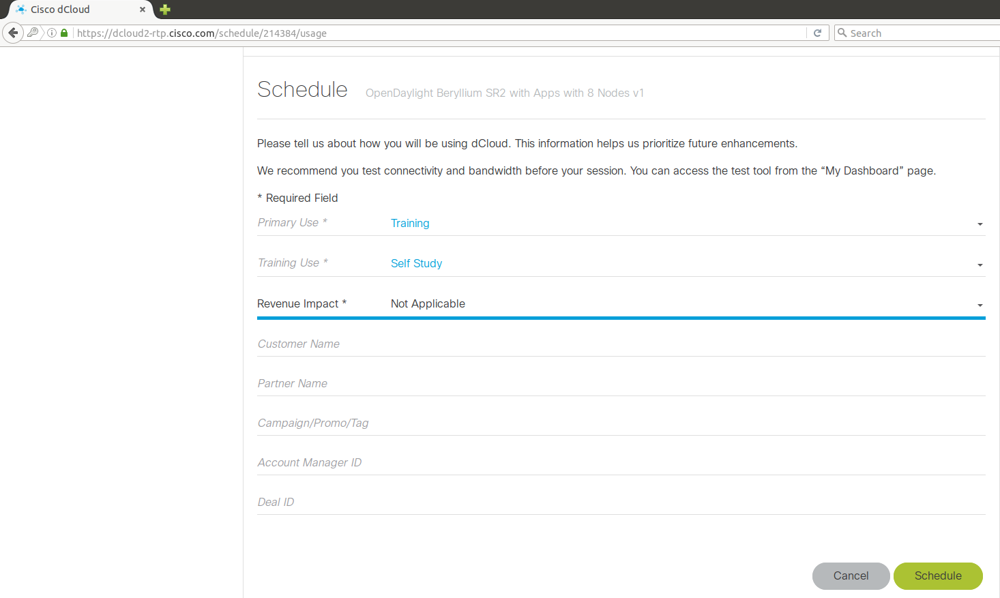

6.  The session should start within few minutes

	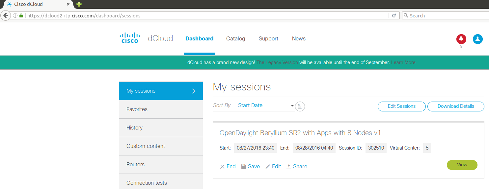

7.  Click on **View** button to see session details

	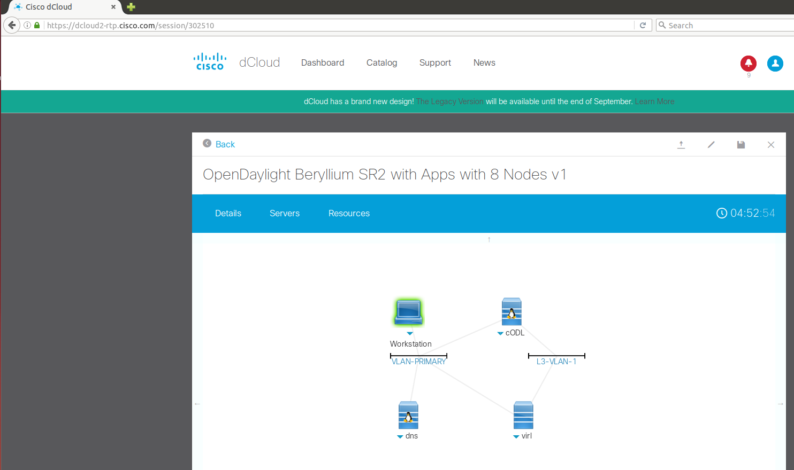

8.  Click on **Details** tab and note down the Anyconnect details, which will be used when connecting Controller VM to the dCloud environment

	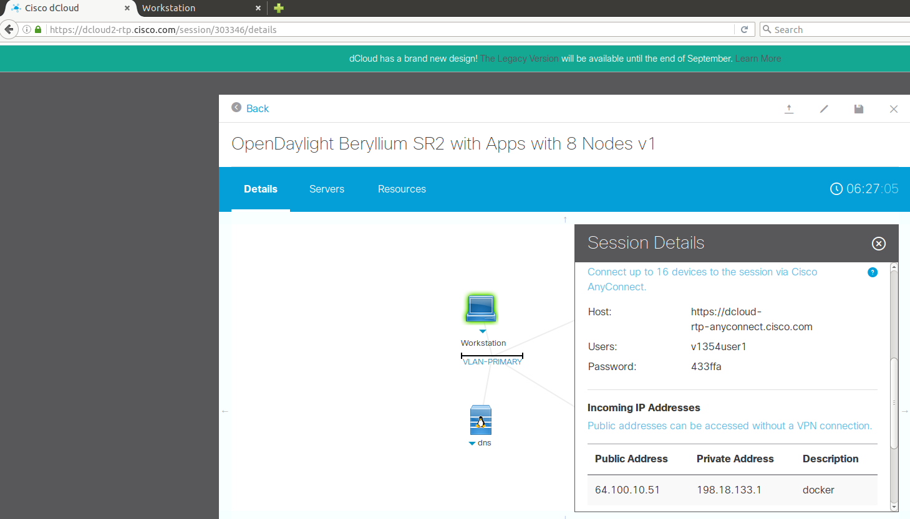

## Verification of dCloud setup

1.  Go to dCloud session details page and click on Workstation icon

	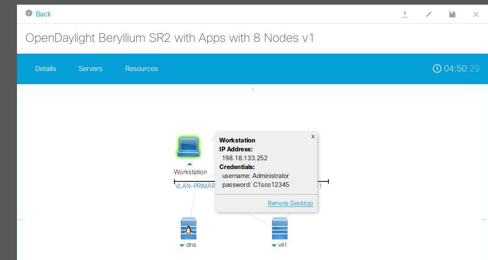

2.  Use the **Remote Desktop** web-client link provided to access the
    Workstation desktop. Chrome browser should open automatically with 3
    tabs, one of them being the status page with Launch Progress

	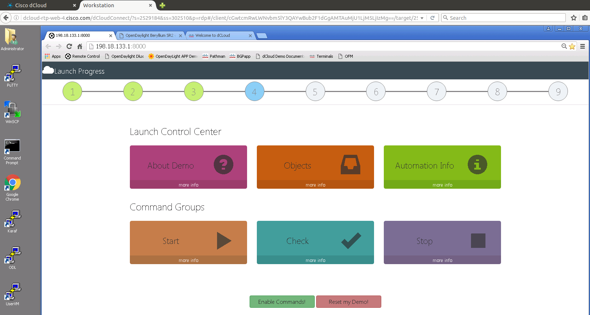

3.  Lab is fully initialized when steps 1 through 9 show up in
    green color. It may take up to 30 minutes for this to happen.
    **However, it is not necessary to wait all 9 steps turning to green in the tutorial.  We are not using the controller provided in dCloud in this case.**

	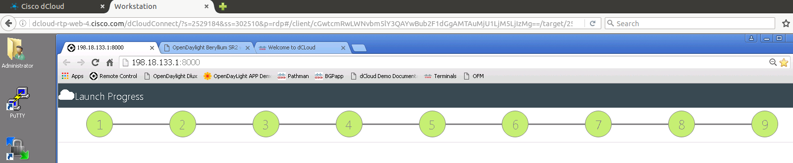
	
## <a name="connect-to-dcloud-lab">Connect to dCloud Lab</a>

To make sure you are able to use the routers in the dCloud lab, you can verify the VPN connection between your VM and dCloud lab use the following steps: 

0. Change *vpn\_credential* file to reflect your dCloud credential

   * There is a [vpn_credential.example](../../vpn_credential.example) file in root directory. Copy that file with command `cp vpn_credential.example vpn_credential` and then change the parameters in *vpn_credential* file.
	
	* *DCLOUD\_VPN\_SITE* is one of *rtp*, *lon*, *sng* or *chi*. For North America, by default the site is *rtp*.

	* You can find your dCloud credential under the **Session Details** of the dCloud dashboard.  Click on the **Workstation** icon to reveal it.

	

	> **NOTE** your unix account will need sudo privileges to start the VPN connection

1.  Run `bin/start-vpn` to start the VPN session

1.  Execute command `bin/check_vpn_status`. It should show that Anyconnect VPN is connected.

	> An interface named `dcloud-tun` should be displayed if the VPN is connected properly.  The `inet addr` shows the VPN tunnel IP address that is assigned to you.  **This VPN IP will be used as your controller's IP in later configuration.**
	
	> **NOTE** Everytime you disconnect and reconnect to the VPN, you may get a different VPN IP.  Remember to change the corresponding controller configuration or XRv configuration wherever the IP is used.
	
	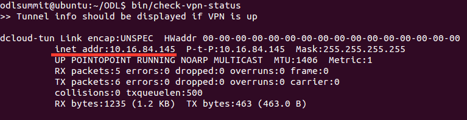
	
3.  After connecting to VPN, you can reach the router by using the command

  ```
  source ./parameters
  telnet $ROUTER_NODE_SJC
  ```

  You can find a list of all other routers avaiable in the [nodes](./nodes) file